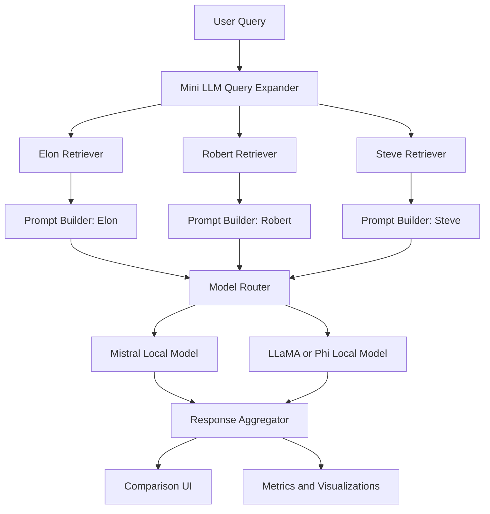
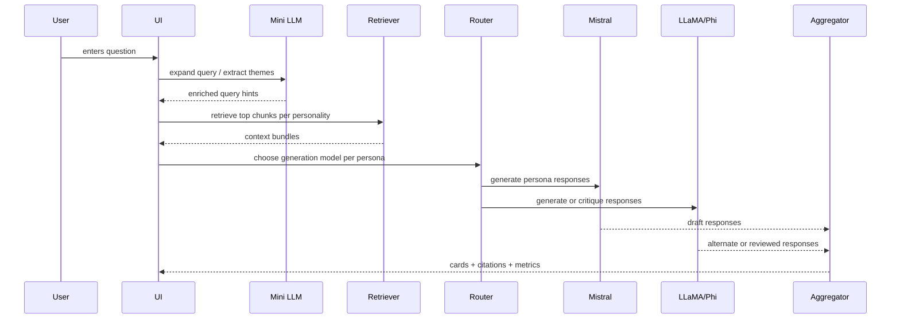
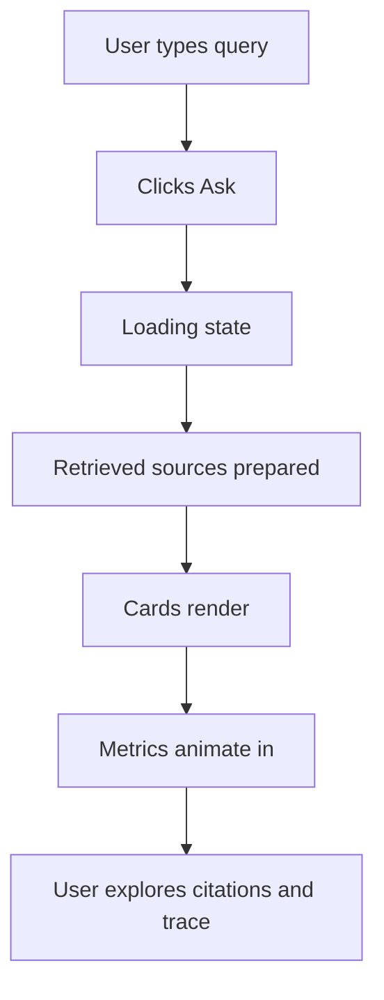
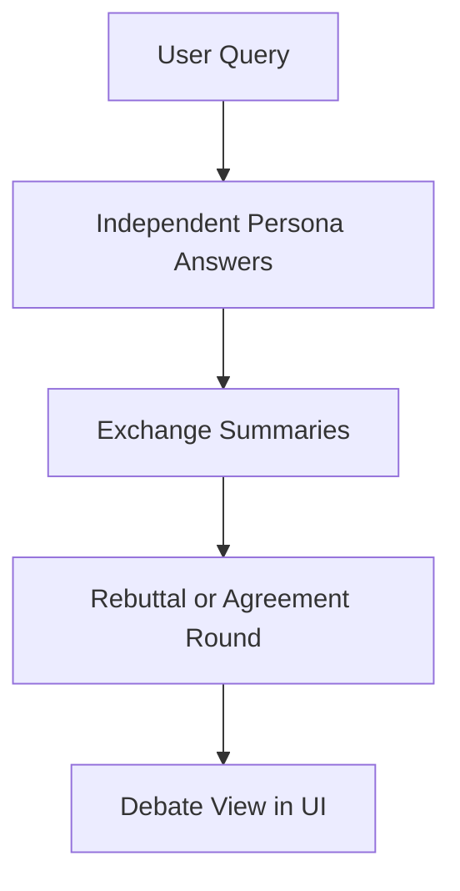

# Multi-Personality LLM System using Local Models (No API)

**A PDF-ready implementation guide for building a local, retrieval-grounded, multi-personality AI system**

**Prepared for:** academic project development  
**Audience:** beginner to intermediate builders with Python familiarity  
**Date context:** April 1, 2026  
**Project base:** existing custom mini LLM already present in this repository

---

## How To Use This Document

This guide is written as a build manual, not as a loose conceptual essay. You can read it in two ways:

1. **Start-to-finish build path**
   Follow the sections in order and implement the system step by step.
2. **Reference manual**
   Jump directly to the sections on retrieval, routing, model integration, UI, or scaling.

The design assumes:

- no external API calls for inference
- all core models are loaded from local directories
- the current repository already contains a small custom PyTorch language model
- the first version uses about five books
- the first demo personalities are Elon Musk, Robert Greene, and Steve Jobs
- the system should later scale to more books, more personas, and more models

This document is intentionally detailed enough to be turned into:

- a semester project
- a capstone demo
- a hackathon-quality prototype
- a portfolio system for recruiters or research interviews

---

## Table of Contents

1. [Introduction](#1-introduction)
2. [Prerequisites](#2-prerequisites)
3. [System Architecture](#3-system-architecture)
4. [Data Preparation](#4-data-preparation)
5. [Embeddings and FAISS](#5-embeddings-and-faiss)
6. [RAG Pipeline](#6-rag-pipeline)
7. [Personality Simulation](#7-personality-simulation)
8. [Multi-Model Setup](#8-multi-model-setup)
9. [Model Routing](#9-model-routing)
10. [Integrating the Existing Mini LLM](#10-integrating-the-existing-mini-llm)
11. [Full Pipeline Integration](#11-full-pipeline-integration)
12. [UI and UX Design](#12-ui-and-ux-design)
13. [Visualization and Wow Factor](#13-visualization-and-wow-factor)
14. [Advanced Features](#14-advanced-features)
15. [Evaluation](#15-evaluation)
16. [Scaling](#16-scaling)
17. [Common Mistakes](#17-common-mistakes)
18. [Folder Structure](#18-folder-structure)
19. [Roadmap](#19-roadmap)
20. [Resources](#20-resources)

---

# 1. Introduction

## 1.1 Project Overview

The goal of this project is to build a **multi-personality local AI system** that answers a user query by combining:

- **retrieval from books**
- **style conditioning by personality**
- **multiple local language models**
- **a UI that visually compares the answers**

At a high level, a user types a question such as:

> "What does success require in the long term?"

The system does not simply ask a single model for one answer. Instead, it:

1. interprets the query
2. retrieves relevant passages from the books associated with each personality
3. builds persona-aware prompts
4. routes the request to one or more local models
5. returns multiple grounded responses side by side

For example:

- **Elon Musk card** focuses on first-principles thinking, engineering ambition, scale, risk, and long-term execution
- **Robert Greene card** focuses on strategy, power dynamics, patience, observation, leverage, and discipline
- **Steve Jobs card** focuses on taste, simplicity, craft, conviction, product intuition, and focus

The crucial idea is that these answers should not feel random. They should be:

- **personality-aware**
- **knowledge-grounded**
- **locally generated**
- **visually comparable**

This makes the project much stronger than a simple chatbot.

## 1.2 Why This Project Is Unique

Many student projects stop at one of the following levels:

- a single fine-tuned model
- a basic RAG chatbot
- a UI wrapped around a generic local model

This project goes further because it combines several system-design ideas into one coherent product:

| Layer | What makes it interesting |
|---|---|
| Knowledge grounding | Answers are tied to retrieved book passages, not only model memory |
| Persona control | Each answer intentionally expresses a different worldview |
| Multi-model reasoning | Different local models can be assigned to different roles |
| Existing model reuse | Your own mini LLM becomes a meaningful part of the system |
| Visual comparison | The UI highlights contrast between personalities |
| Offline-first design | No dependency on API keys for core inference |

This combination gives the project academic depth and practical product value.

## 1.3 Real-World Use Cases

Although the first version is based on books and public personalities, the pattern generalizes to many serious applications.

### Educational Use Cases

- compare philosophers on ethics
- compare economists on inflation
- compare founders on startup strategy
- compare management thinkers on leadership
- compare scientists on innovation

### Professional Use Cases

- executive decision support with multiple strategic lenses
- legal research with contrasting jurisprudential viewpoints
- product design critiques from different stakeholder personas
- sales coaching with role-specific conversational styles
- career mentoring from different leadership archetypes

### Demo and Portfolio Value

From a professor's perspective, this project is compelling because it shows you can think in terms of:

- model design
- system orchestration
- knowledge engineering
- product design
- evaluation
- scale planning

From a recruiter’s perspective, it signals that you understand not just one library, but the full stack of modern LLM systems:

- data
- embeddings
- vector search
- prompt construction
- multi-model orchestration
- frontend experience
- debugging and observability

## 1.4 What This Project Is Not

It is useful to clarify what this system is not trying to do.

It is **not**:

- a perfect simulation of real people
- a factual biography engine
- a pure fine-tuning-only system
- a generic chatbot with no grounded sources
- a cloud-hosted SaaS API product

Instead, it is a **persona-inspired knowledge synthesis system**. That wording is important for both design honesty and academic framing.

The system should aim to produce responses that are:

- inspired by known communication patterns
- grounded in relevant text sources
- clearly attributable to retrieved evidence
- stylistically distinct but not misleadingly "authentic"

## 1.5 Core Design Principle

The most important design principle in this guide is:

> **Do not force one model to do everything. Build a pipeline where each component does one job well.**

This is the right mindset because your current custom mini LLM is valuable, but it is small. In your existing project, the training configuration is intentionally compact:

- `d_model = 256`
- `n_layers = 4`
- `max_seq_len = 256`

That makes it excellent for learning and lightweight experimentation, but not the ideal sole engine for multi-personality long-form reasoning. So instead of replacing it, we give it a role that suits its strengths.

## 1.6 The Three-Model Strategy

This guide uses three local generative models:

1. **Existing Mini LLM**
   Used for fast concept expansion, query warmup, theme hints, and baseline comparison.

2. **Mistral-family local model**
   Used as the strongest main response generator, optionally fine-tuned using Unsloth on supported hardware.

3. **LLaMA-family or Phi-family local model**
   Used as either:
   - a second generator for contrast
   - a reviewer/judge
   - a style corrector
   - a fallback model for lower-resource inference

This allows you to present the project as a true system rather than a single-model demo.

## 1.7 Recommended Outcome for the First Demo

For the first professor-facing version, aim for this user flow:

1. The user asks a question such as:
   - "What is success?"
   - "How should I deal with failure?"
   - "How do great builders stay focused?"

2. The system retrieves relevant passages from each personality’s book set.

3. The system generates three side-by-side answers:
   - Elon Musk view
   - Robert Greene view
   - Steve Jobs view

4. The UI shows:
   - answer text
   - source snippets
   - confidence or grounding indicators
   - response-length comparison
   - highlighted differences

This is enough for a serious first version and already much more impressive than a simple chatbot.

---

# 2. Prerequisites

## 2.1 Technical Skills You Should Be Comfortable With

You do not need to be an expert in deep learning research to build this system, but you should be comfortable with the following:

- Python scripting
- reading and writing files
- creating classes and functions
- using virtual environments
- installing packages
- understanding JSON and CSV/JSONL
- basic PyTorch and transformer vocabulary

If you are still new to some of these areas, that is okay. This guide is designed to be beginner-to-intermediate friendly. The system becomes manageable if you think of it as five smaller problems:

1. organize the books
2. index the books
3. load the models
4. build prompts
5. display results cleanly

## 2.2 Python Environment

You will want a dedicated environment for the multi-personality system so it does not conflict with your current mini LLM environment.

### Suggested Package Set

```txt
torch
transformers
accelerate
sentence-transformers
faiss-cpu
pandas
numpy
gradio
matplotlib
datasets
peft
jinja2
pyyaml
```

Optional packages depending on your hardware and inference choice:

```txt
bitsandbytes
unsloth
trl
llama-cpp-python
mlx-lm
```

### Suggested Installation Flow

```bash
python -m venv .venv-multipersona
source .venv-multipersona/bin/activate
pip install --upgrade pip
pip install torch transformers accelerate sentence-transformers faiss-cpu pandas numpy gradio matplotlib datasets peft jinja2 pyyaml
```

If you are on Linux or WSL with NVIDIA and plan to fine-tune via Unsloth:

```bash
pip install unsloth trl
```

If you are on Apple Silicon and plan to use MLX-based local inference or tuning:

```bash
pip install mlx-lm
```

## 2.3 Hardware Understanding

Your hardware matters because different parts of this system have different memory needs.

### Memory Buckets

| Component | Approximate need |
|---|---|
| Book chunking | low |
| Embedding generation | low to moderate |
| FAISS indexing | low for small corpora |
| Mini LLM inference | low |
| 7B model inference | moderate |
| 7B fine-tuning | high |
| Multi-model parallel inference | moderate to high |

For five books, the knowledge base itself is small enough that retrieval is easy. The main hardware challenge is not FAISS. The main challenge is large-model inference and fine-tuning.

### Important Note About Unsloth on Mac

As of **April 1, 2026**, Unsloth’s official documentation indicates:

- Unsloth Studio on Mac supports local chat for GGUF models and data recipes
- Unsloth Studio training support for Apple MLX is still described as coming soon
- Unsloth training is primarily documented for Linux/Windows with supported accelerators

That means:

- if you have an NVIDIA machine, use Unsloth there for the Mistral fine-tuning path
- if you only have Apple Silicon, treat local inference as primary and use MLX-LM or GGUF-based inference for the second model path

This does **not** break the project. It only changes how you train or prepare one of the models.

## 2.4 LLM Basics You Need

You should understand these five concepts clearly.

### Tokenization

A model does not see raw text. It sees token IDs. Your existing mini LLM already uses a tokenizer file and maps text into IDs before generation.

Why this matters here:

- prompt length affects retrieval context size
- chunk size should loosely correspond to token count, not only character count
- local models have context length limits

### Context Window

The context window is how much text the model can consider at once.

In your current mini LLM, the context length is small. Larger local instruct models usually support much larger windows, but you still should not dump entire books into the prompt. Use retrieval to choose only the relevant chunks.

### Base Model vs Instruct Model

- **Base model**: predicts next tokens, not optimized for following instructions
- **Instruct model**: trained or aligned to follow prompts more usefully

For this project, use instruct models for the Mistral and LLaMA/Phi branches. They are much better for clean question answering with persona conditioning.

### Fine-Tuning

Fine-tuning means adapting a base or instruct model to your domain, style, or task. In practice for this project, the most realistic approach is **LoRA/QLoRA** instead of full fine-tuning.

### Inference

Inference is the process of generating answers from the trained or downloaded local model. This is what the UI will call at runtime.

## 2.5 What RAG Means in This Project

RAG stands for **Retrieval-Augmented Generation**.

In plain language:

1. Retrieve relevant text from your knowledge base.
2. Feed that retrieved text into the prompt.
3. Ask the model to answer using that text.

Why it matters here:

- books are too long to fit directly into prompts
- retrieval improves grounding
- updating the library becomes easier than retraining everything
- different personalities can retrieve different evidence

For your system, RAG is not optional. It is the foundation.

## 2.6 FAISS Basics

FAISS is a vector similarity library used to search text chunks by semantic similarity after they are embedded into vectors.

At a conceptual level:

- each chunk of text becomes a vector
- the user query becomes a vector
- FAISS finds the stored vectors closest to the query vector

For the first version with five books, you do not need the most advanced index type. A simple index is enough and easier to debug.

## 2.7 Prompting Basics

Prompting is not just "ask the model something." In a serious system, prompting is structured and repeatable.

You will build prompts with these layers:

- system instructions
- persona card
- retrieved evidence
- user question
- response format instructions

Bad prompting:

- "Answer like Elon Musk"

Good prompting:

- define the persona style in a reusable template
- inject evidence retrieved from that persona’s books
- tell the model to ground claims in those sources
- ask for a specific answer structure

## 2.8 Local Inference Basics

Since this project must use no API, you need to understand local model loading patterns.

There are three common local-loading approaches:

| Approach | Best for | Typical library |
|---|---|---|
| Full Hugging Face model directory | local GPU / accelerated inference | `transformers` |
| Quantized GGUF file | laptop / CPU / Apple-friendly local runs | `llama-cpp-python` |
| Apple Silicon optimized models | Mac local runs | `mlx-lm` |

The right approach depends on the model and hardware, but the architecture of your system does not change.

## 2.9 Why Not Just Fine-Tune Everything

A common beginner mistake is thinking:

> "If I fine-tune one model on all five books, the problem is solved."

This usually fails for four reasons:

1. The model may memorize style poorly without good instruction-format data.
2. The system loses explicit grounding.
3. Updating the library becomes expensive.
4. You cannot easily show which source informed the answer.

So the strongest design is:

- **retrieval for knowledge**
- **prompt templates for personality**
- **fine-tuning only when it gives measurable benefit**

## 2.10 Recommended Beginner Mindset

Treat the system as a **product pipeline**, not just an ML experiment.

The build order should be:

1. get clean text
2. chunk and index it
3. retrieve correctly
4. build persona prompts
5. load one strong local model
6. add second model
7. integrate your mini LLM
8. build the UI
9. evaluate and polish

That order saves you weeks of confusion.

---

# 3. System Architecture

## 3.1 High-Level Architecture

The system consists of five major functional modules:

1. **Retriever**
   Finds the most relevant book chunks.
2. **Personality Controller**
   Shapes the answer for a specific persona.
3. **Prompt Builder**
   Combines query, retrieved context, persona instructions, and format rules.
4. **Model Router**
   Selects which local model should handle which generation task.
5. **Response Aggregator**
   Collects outputs, scores them, and prepares them for the UI.

Your custom mini LLM is integrated as an upstream helper model, not just a leftover artifact.

## 3.2 Architecture Diagram



This diagram is important because it shows that the personalities are not created by one giant hardcoded prompt. They are produced by a modular system.

## 3.3 Sequence of Events



## 3.4 Architectural Goals

Your architecture should optimize for six goals:

| Goal | Why it matters |
|---|---|
| Grounding | prevents generic or hallucinated answers |
| Distinctiveness | makes each personality card feel different |
| Locality | satisfies the no-API requirement |
| Modularity | lets you replace parts without rewriting everything |
| Visibility | helps the professor see how the system works |
| Scalability | lets you add books and personalities later |

If any design decision harms all six, avoid it.

## 3.5 Component Breakdown

### Retriever

Input:

- user query
- optional expanded query
- personality ID

Output:

- top relevant chunks
- chunk metadata
- citation-ready source references

Responsibility:

- semantic search over the indexed book corpus
- optionally reranking top candidates
- filtering to relevant personalities

### Personality Controller

Input:

- personality metadata
- tone rules
- response constraints

Output:

- style-conditioned instructions

Responsibility:

- makes Elon sound different from Steve
- enforces worldview differences
- avoids prompt duplication across personas

### Prompt Builder

Input:

- query
- expanded query
- retrieved chunks
- persona instructions

Output:

- final prompt string

Responsibility:

- turns system state into model-ready text
- structures evidence blocks
- adds formatting constraints

### Model Router

Input:

- persona
- query type
- available hardware
- model availability

Output:

- selected local model

Responsibility:

- decide whether Mistral or LLaMA/Phi should generate a given persona answer
- fallback when a model is unavailable
- choose review mode versus generation mode

### Response Aggregator

Input:

- multiple response objects
- citations
- auxiliary metrics

Output:

- UI-ready response cards
- comparison metrics
- trace logs

Responsibility:

- normalize outputs to a common structure
- compute simple analytics
- package everything for display

## 3.6 System Data Objects

Define a few standard objects early. This prevents chaos later.

### QueryRequest

```python
from dataclasses import dataclass
from typing import Optional

@dataclass
class QueryRequest:
    query: str
    debate_mode: bool = False
    style_strength: float = 0.7
    top_k: int = 4
    session_id: Optional[str] = None
```

### RetrievedChunk

```python
from dataclasses import dataclass

@dataclass
class RetrievedChunk:
    chunk_id: str
    personality_id: str
    book_id: str
    chapter: str
    text: str
    source_label: str
    score: float
```

### PersonaResponse

```python
from dataclasses import dataclass, field
from typing import List, Dict

@dataclass
class PersonaResponse:
    personality_id: str
    display_name: str
    model_name: str
    answer: str
    citations: List[RetrievedChunk] = field(default_factory=list)
    metrics: Dict[str, float] = field(default_factory=dict)
```

These small objects make the rest of the code much easier to maintain.

## 3.7 Recommended Local Project Layout

Use a directory-aware layout from the beginning.

```text
project-root/
├── models/
├── data/
├── embeddings/
├── rag/
├── ui/
├── prompts/
├── outputs/
├── src/
├── model.pt
└── tokenizer.json
```

This separation is not cosmetic. It supports clean responsibilities:

- `models/` stores local inference assets
- `data/` stores raw and processed corpora
- `embeddings/` stores FAISS and metadata files
- `rag/` stores retrieval and orchestration logic
- `ui/` stores interface code
- `prompts/` stores reusable prompt templates

## 3.8 Why Separate Retrieval by Personality

One of the most important design decisions is whether you:

1. retrieve from one combined corpus and filter later
2. or build separate persona-aware retrieval spaces

For a first version, I strongly recommend:

- one **global index**
- plus one **index per personality**

Why both?

| Index type | Benefit |
|---|---|
| Global index | can detect cross-personality relevance and support future comparison queries |
| Personality index | guarantees each personality card is grounded in that person’s own corpus |

This hybrid layout gives flexibility without much extra complexity because your starting corpus is small.

## 3.9 System Modes

The system can support multiple runtime modes.

### Standard Comparison Mode

One user question produces one answer per personality.

### Debate Mode

Each personality first answers independently, then reacts to one or two other answers.

### Consensus Mode

A final synthesis model or prompt generates a shared summary across all personalities.

### Trace Mode

The UI shows:

- retrieved chunks
- selected model
- prompt length
- inference latency
- confidence indicators

This is highly useful in demos because it proves the system is engineered, not merely faked.

## 3.10 Architecture Choice for the First Build

For the first working version, use this exact role allocation:

| Component | Role |
|---|---|
| Mini LLM | query expansion and baseline hint generation |
| Mistral | primary long-form answer generation |
| Phi or LLaMA | alternate generator and reviewer |
| Embedding model | local semantic retrieval |
| FAISS | fast vector search |
| Gradio Blocks | comparison UI |

This is a very strong first architecture because it is:

- understandable
- demoable
- extensible

---

# 4. Data Preparation

## 4.1 Why Data Preparation Determines Quality

If your books are messy, your retrieval is weak. If retrieval is weak, the final answers will feel generic no matter how good the model is.

This means your most important early investment is not model tweaking. It is **data quality**.

For personality-grounded systems, the corpus must preserve:

- source identity
- chapter structure
- chunk boundaries
- personality ownership
- citation-ready metadata

## 4.2 Recommended Source Types

Start with plain text if possible.

Good sources:

- `.txt` exports of books you are permitted to use
- clean notes from book summaries
- transcripts of talks or interviews
- structured excerpts with source references

Harder sources:

- raw PDFs
- OCR-scanned pages
- EPUB with formatting noise
- scraped webpages with menu text mixed in

If your first version uses only five books, it is worth manually cleaning them. This gives much better results than trying to automate messy OCR too early.

## 4.3 Proposed Book Organization

Store the raw text like this:

```text
data/
├── raw/
│   └── books/
│       ├── elon_musk/
│       │   ├── book_01.txt
│       │   └── interviews_01.txt
│       ├── robert_greene/
│       │   ├── 48_laws_excerpt.txt
│       │   └── mastery_excerpt.txt
│       └── steve_jobs/
│           ├── jobs_biography_notes.txt
│           └── speeches_01.txt
└── processed/
```

Keep the folders personality-specific from the start. It simplifies retrieval and later evaluation.

## 4.4 Metadata You Must Preserve

For every chunk, keep metadata such as:

| Field | Example |
|---|---|
| `chunk_id` | `elon_musk_book01_ch03_0004` |
| `personality_id` | `elon_musk` |
| `book_id` | `book01` |
| `title` | `Elon biography notes` |
| `chapter` | `Chapter 3` |
| `text` | actual chunk text |
| `start_offset` | `10432` |
| `end_offset` | `10987` |
| `source_label` | `Elon / Book 01 / Ch 3` |

Without this metadata, your citations and debugging become painful later.

## 4.5 Cleaning Guidelines

Before chunking, clean the text. Remove:

- page numbers
- repeated headers and footers
- OCR line breaks in the middle of sentences
- weird punctuation artifacts
- duplicate passages
- tables of contents unless they are truly meaningful

Preserve:

- paragraph breaks
- chapter headings
- section titles
- quotations if they are useful

### Example Cleaning Function

```python
import re

def clean_text(text: str) -> str:
    text = text.replace("\r\n", "\n").replace("\r", "\n")
    text = re.sub(r"[ \t]+", " ", text)
    text = re.sub(r"\n{3,}", "\n\n", text)
    text = re.sub(r"Page\s+\d+\s*", "", text, flags=re.IGNORECASE)
    return text.strip()
```

This is intentionally simple. For a small project, simple and predictable cleaning is often better than over-engineered preprocessing.

## 4.6 Chunking Strategy

Chunking is the process of dividing long text into smaller segments for embedding and retrieval.

For your use case, a good initial chunk strategy is:

- target chunk length: **250 to 450 words**
- overlap: **40 to 80 words**
- preserve paragraph boundaries when possible

Why not use very tiny chunks?

- tiny chunks lose argument context
- strategic or philosophical writing often needs several sentences together

Why not use huge chunks?

- huge chunks reduce retrieval precision
- too much irrelevant text reaches the prompt

## 4.7 Personality-Aware Chunking

Each chunk should belong to exactly one personality folder, even if a book discusses multiple people. For the initial project, do not overcomplicate this by mixing corpora. The goal is clear grounding.

If a source contains multiple speakers, split it before chunking.

## 4.8 Chunking Implementation

Below is a beginner-friendly paragraph-aware chunker.

```python
from pathlib import Path
from typing import List, Dict
import json

def split_into_chunks(
    text: str,
    target_words: int = 320,
    overlap_words: int = 60,
) -> List[str]:
    paragraphs = [p.strip() for p in text.split("\n\n") if p.strip()]
    chunks = []
    current = []
    current_words = 0

    for paragraph in paragraphs:
        word_count = len(paragraph.split())

        if current and current_words + word_count > target_words:
            chunk_text = "\n\n".join(current).strip()
            chunks.append(chunk_text)

            overlap_buffer = chunk_text.split()[-overlap_words:]
            current = [" ".join(overlap_buffer), paragraph]
            current_words = len(" ".join(overlap_buffer).split()) + word_count
        else:
            current.append(paragraph)
            current_words += word_count

    if current:
        chunks.append("\n\n".join(current).strip())

    return chunks


def build_chunk_records(personality_id: str, book_id: str, title: str, text: str) -> List[Dict]:
    chunk_texts = split_into_chunks(text)
    records = []

    for idx, chunk_text in enumerate(chunk_texts):
        chunk_id = f"{personality_id}_{book_id}_{idx:04d}"
        records.append(
            {
                "chunk_id": chunk_id,
                "personality_id": personality_id,
                "book_id": book_id,
                "title": title,
                "chapter": "",
                "source_label": f"{personality_id} / {title} / chunk {idx}",
                "text": chunk_text,
            }
        )

    return records
```

## 4.9 Example Ingestion Script

```python
from pathlib import Path
import json

RAW_BOOKS_DIR = Path("data/raw/books")
OUTPUT_PATH = Path("data/processed/chunks.jsonl")


def infer_book_id(path: Path) -> str:
    return path.stem.lower().replace(" ", "_")


def ingest_books() -> None:
    OUTPUT_PATH.parent.mkdir(parents=True, exist_ok=True)

    with OUTPUT_PATH.open("w", encoding="utf-8") as out:
        for personality_dir in RAW_BOOKS_DIR.iterdir():
            if not personality_dir.is_dir():
                continue

            personality_id = personality_dir.name

            for text_file in personality_dir.glob("*.txt"):
                text = text_file.read_text(encoding="utf-8")
                text = clean_text(text)
                book_id = infer_book_id(text_file)
                title = text_file.stem

                for record in build_chunk_records(personality_id, book_id, title, text):
                    out.write(json.dumps(record, ensure_ascii=False) + "\n")


if __name__ == "__main__":
    ingest_books()
```

## 4.10 Building Persona Cards

In addition to chunks, create a separate personality metadata file.

```json
{
  "elon_musk": {
    "display_name": "Elon Musk",
    "style_tags": ["first-principles", "engineering", "scale", "risk", "future-oriented"],
    "tone": "intense, technical, ambitious",
    "dos": ["reason from fundamentals", "discuss constraints", "stress execution"],
    "donts": ["sound generic", "be passive", "use vague motivational clichés"]
  },
  "robert_greene": {
    "display_name": "Robert Greene",
    "style_tags": ["strategic", "observant", "patient", "power-aware", "historical"],
    "tone": "measured, analytical, cautionary",
    "dos": ["frame through patterns of power", "stress discipline and patience"],
    "donts": ["sound bubbly", "be overly technical", "ignore social dynamics"]
  },
  "steve_jobs": {
    "display_name": "Steve Jobs",
    "style_tags": ["simplicity", "taste", "craft", "focus", "conviction"],
    "tone": "clean, decisive, product-driven",
    "dos": ["value simplicity", "focus on what matters", "stress excellence"],
    "donts": ["ramble", "sound academic", "over-explain without insight"]
  }
}
```

This file becomes the base of your personality controller.

## 4.11 Gold Dataset for Evaluation

Before moving on, create a small file of test queries and expected behavior.

Example:

```json
[
  {
    "query": "What is success?",
    "expected_traits": {
      "elon_musk": ["ambition", "engineering", "hard problems"],
      "robert_greene": ["strategy", "patience", "self-mastery"],
      "steve_jobs": ["focus", "craft", "taste"]
    }
  }
]
```

This is useful later when you evaluate whether the personalities truly differ.

---

# 5. Embeddings and FAISS

## 5.1 What Embeddings Do

Embeddings transform text into vectors such that semantically similar text lands near each other in vector space.

This is what allows the system to find relevant passages even when the wording does not exactly match the user query.

Example:

- user asks: "How do you stay focused on important work?"
- relevant chunk says: "Great builders eliminate distraction and preserve energy for the few things that truly matter."

Keyword matching alone might miss this. Embeddings usually will not.

## 5.2 Choosing an Embedding Model

For a small local project, use a compact sentence-transformer or BGE-style model stored locally in `models/embeddings/`.

Good local options:

- `bge-small-en-v1.5`
- `all-MiniLM-L6-v2`
- `e5-small`

Since the guide is implementation-oriented, we will assume a local directory like:

```text
models/embeddings/bge-small-en-v1.5/
```

Once downloaded once, you can load it offline by path.

## 5.3 Why FAISS Is a Good Fit

For five books, FAISS is almost certainly enough. You do not need a heavyweight vector database yet.

FAISS advantages:

- fast local similarity search
- simple Python integration
- file-based persistence
- easy experimentation with index types

For your first build, choose simplicity over sophistication.

## 5.4 Index Strategy for the First Version

Use:

- `IndexFlatIP` with normalized embeddings for cosine-style similarity

Why this is a good first choice:

- exact search
- easy to debug
- no training step required
- corpus is still small

Later, when the corpus grows, you can move to:

- IVF
- HNSW
- PQ compression

But do not start there.

## 5.5 Directory Layout for Embeddings

```text
embeddings/
├── global.faiss
├── global_metadata.jsonl
├── elon_musk.faiss
├── elon_musk_metadata.jsonl
├── robert_greene.faiss
├── robert_greene_metadata.jsonl
├── steve_jobs.faiss
├── steve_jobs_metadata.jsonl
└── stats.json
```

This is explicit, readable, and easy to debug.

## 5.6 Building Embeddings

```python
from pathlib import Path
import json
import numpy as np
import faiss
from sentence_transformers import SentenceTransformer

CHUNKS_PATH = Path("data/processed/chunks.jsonl")
EMBEDDING_MODEL_DIR = Path("models/embeddings/bge-small-en-v1.5")
EMBEDDINGS_DIR = Path("embeddings")


def load_chunks(path: Path):
    with path.open("r", encoding="utf-8") as f:
        for line in f:
            yield json.loads(line)


def build_faiss_index(records, out_index_path: Path, out_meta_path: Path):
    texts = [r["text"] for r in records]

    model = SentenceTransformer(str(EMBEDDING_MODEL_DIR))
    vectors = model.encode(
        texts,
        batch_size=32,
        show_progress_bar=True,
        normalize_embeddings=True,
    ).astype("float32")

    dim = vectors.shape[1]
    index = faiss.IndexFlatIP(dim)
    index.add(vectors)

    out_index_path.parent.mkdir(parents=True, exist_ok=True)
    faiss.write_index(index, str(out_index_path))

    with out_meta_path.open("w", encoding="utf-8") as f:
        for record in records:
            f.write(json.dumps(record, ensure_ascii=False) + "\n")
```

## 5.7 Building Separate Indices

```python
from collections import defaultdict


def main():
    all_records = list(load_chunks(CHUNKS_PATH))

    build_faiss_index(
        records=all_records,
        out_index_path=EMBEDDINGS_DIR / "global.faiss",
        out_meta_path=EMBEDDINGS_DIR / "global_metadata.jsonl",
    )

    grouped = defaultdict(list)
    for record in all_records:
        grouped[record["personality_id"]].append(record)

    for personality_id, records in grouped.items():
        build_faiss_index(
            records=records,
            out_index_path=EMBEDDINGS_DIR / f"{personality_id}.faiss",
            out_meta_path=EMBEDDINGS_DIR / f"{personality_id}_metadata.jsonl",
        )


if __name__ == "__main__":
    main()
```

## 5.8 Retrieval Helper

```python
import json
from pathlib import Path
import faiss
import numpy as np
from sentence_transformers import SentenceTransformer


class FaissRetriever:
    def __init__(self, index_path: Path, metadata_path: Path, model_dir: Path):
        self.index = faiss.read_index(str(index_path))
        self.records = [
            json.loads(line)
            for line in metadata_path.read_text(encoding="utf-8").splitlines()
            if line.strip()
        ]
        self.model = SentenceTransformer(str(model_dir))

    def search(self, query: str, top_k: int = 4):
        vector = self.model.encode([query], normalize_embeddings=True).astype("float32")
        scores, indices = self.index.search(vector, top_k)

        results = []
        for score, idx in zip(scores[0], indices[0]):
            if idx < 0:
                continue
            record = dict(self.records[idx])
            record["score"] = float(score)
            results.append(record)
        return results
```

## 5.9 Retrieval Patterns That Work Well

For this project, retrieval works best when you use:

- the original user query
- an expanded theme query from the mini LLM
- personality filtering

Example:

User query:

> "How do I build something meaningful?"

Expanded retrieval query might be:

> "meaningful work, focus, product vision, long-term craft, strategic execution"

This can significantly improve retrieval quality.

## 5.10 Best Practices for Small-Corpus RAG

Because your corpus is small, the major risk is not missing data. The risk is **retrieving the wrong few chunks**. So focus on:

- chunk quality
- metadata clarity
- top-k tuning
- prompt formatting

For five books, do not over-optimize FAISS internals before you confirm chunk usefulness manually.

## 5.11 Recommended Debug Method

For ten sample queries, print the top retrieved chunks and inspect them manually.

Example debug output:

```python
results = retriever.search("success through focus", top_k=3)
for r in results:
    print(r["source_label"], r["score"])
    print(r["text"][:300])
    print("-" * 80)
```

If retrieval is weak, fix the data before blaming the model.

---

# 6. RAG Pipeline

## 6.1 What the Pipeline Must Achieve

The RAG layer is where your project becomes a real system.

It must take a raw question and turn it into:

- evidence per personality
- prompt-ready context bundles
- citation-ready outputs

The pipeline is the bridge between your corpus and your generators.

## 6.2 End-to-End RAG Flow


Each step should be visible in logs so you can debug it.

## 6.3 Query Expansion

The first optional stage uses your mini LLM to enrich the query.

Why this is useful:

- users may ask short questions like "success" or "discipline"
- retrieval works better with a slightly richer semantic description

Your mini LLM can generate related themes or continuation hints which you then use only for retrieval, not as final truth.

Example:

- input: `success`
- expanded: `long-term effort, focus, resilience, ambition, mastery, disciplined execution`

## 6.4 Persona-Specific Retrieval

Instead of retrieving one shared pool for everyone, do retrieval separately for each personality.

This matters because:

- Steve Jobs texts about focus are not the same as Robert Greene texts about focus
- the same query should surface different passages in each worldview

### Simple Strategy

For each personality:

1. search their own FAISS index
2. take top `k` chunks
3. optionally deduplicate highly overlapping chunks
4. pass these chunks into the prompt builder

## 6.5 Context Selection Rules

Do not dump every retrieved chunk into the prompt. Select a compact, high-signal context bundle.

Recommended strategy:

- retrieve `top_k = 6`
- keep best `3` or `4`
- enforce source diversity if possible
- keep total retrieved context under your model’s comfortable token budget

For the first version, it is perfectly acceptable to simply keep the top 3 chunks.

## 6.6 RAG Context Formatter

Use a consistent evidence format.

```python
def format_context(chunks: list[dict]) -> str:
    blocks = []
    for idx, chunk in enumerate(chunks, start=1):
        blocks.append(
            f"[Source {idx}] {chunk['source_label']}\n"
            f"{chunk['text']}"
        )
    return "\n\n".join(blocks)
```

This format helps both the model and the UI.

## 6.7 RAG Bundle Object

```python
from dataclasses import dataclass
from typing import List

@dataclass
class RAGBundle:
    personality_id: str
    query: str
    expanded_query: str
    chunks: List[dict]
    context_text: str
```

This object makes downstream prompt building very clean.

## 6.8 RAG Builder Implementation

```python
class PersonaRAGService:
    def __init__(self, retrievers: dict):
        self.retrievers = retrievers

    def build_bundle(
        self,
        personality_id: str,
        query: str,
        expanded_query: str,
        top_k: int = 4,
    ) -> RAGBundle:
        retrieval_query = expanded_query or query
        chunks = self.retrievers[personality_id].search(retrieval_query, top_k=top_k)
        context_text = format_context(chunks)

        return RAGBundle(
            personality_id=personality_id,
            query=query,
            expanded_query=expanded_query,
            chunks=chunks,
            context_text=context_text,
        )
```

## 6.9 Retrieval Quality Checks

Before you trust generation, inspect whether the retrieved chunks are:

- clearly relevant
- diverse enough
- appropriately persona-specific
- not duplicates
- not too long

If Elon, Robert, and Steve all retrieve nearly the same generic chunk summaries, your personality contrast will be weak even with good prompts.

## 6.10 Grounding Instructions

Your prompts should tell the model:

- to use the retrieved evidence
- to avoid unsupported claims
- to avoid long verbatim copying
- to stay concise and persona-consistent

This is important because books are copyrighted and because grounded synthesis is better than reproduction.

## 6.11 Example Full RAG Preparation

```python
def prepare_persona_contexts(query: str, expanded_query: str, rag_service: PersonaRAGService):
    bundles = {}
    for personality_id in ["elon_musk", "robert_greene", "steve_jobs"]:
        bundles[personality_id] = rag_service.build_bundle(
            personality_id=personality_id,
            query=query,
            expanded_query=expanded_query,
            top_k=4,
        )
    return bundles
```

## 6.12 Why This Pipeline Scales Well

Once this RAG layer is in place, adding more books becomes much easier:

- ingest new text
- rebuild chunks
- refresh embeddings
- keep the rest of the system stable

This is a major architectural advantage over relying only on fine-tuning.

---

# 7. Personality Simulation

## 7.1 What Personality Means Here

In this project, personality does **not** mean perfect impersonation. It means a controlled combination of:

- vocabulary tendencies
- tone
- pacing
- worldview
- preferred reasoning style
- decision priorities

This is the correct technical definition because it is actionable in prompts and evaluation.

## 7.2 Three Layers of Persona Control

You should shape personality using three layers at once:

1. **corpus selection**
   each personality retrieves from their own books
2. **persona card**
   system prompt defines tone and framing
3. **output format**
   answer structure emphasizes each personality’s style

If you only use the prompt and ignore corpus separation, the personalities will blur together.

## 7.3 Persona Card Design

A persona card should be concise enough to fit in prompts, but specific enough to actually change behavior.

### Elon Musk Persona Card

```text
Name: Elon Musk
Tone: intense, analytical, future-oriented, engineering-first
Core worldview: solve meaningful problems at scale; reason from fundamentals; embrace difficulty
Preferred concepts: first principles, manufacturing, leverage, iteration, risk, mission
Response style: direct, ambitious, technically grounded, forward-looking
Avoid: generic motivational language, soft ambiguity, excessive emotional framing
```

### Robert Greene Persona Card

```text
Name: Robert Greene
Tone: strategic, calm, observant, disciplined
Core worldview: understand human nature, power, patience, timing, mastery
Preferred concepts: leverage, self-control, long games, seduction of power, social intelligence
Response style: reflective, pattern-based, historically framed, cautionary
Avoid: hype, engineering jargon, overly casual tone
```

### Steve Jobs Persona Card

```text
Name: Steve Jobs
Tone: minimalist, decisive, taste-driven, product-focused
Core worldview: great work comes from focus, craft, simplicity, and conviction
Preferred concepts: excellence, simplicity, saying no, end-to-end experience, design taste
Response style: clean, sharp, emotionally resonant, concrete
Avoid: bloated explanations, academic abstraction, strategic cynicism
```

## 7.4 Prompt Template Design

Use template files in `prompts/personas/` and `prompts/templates/`.

Recommended structure:

```text
prompts/
├── system/
│   └── grounding.txt
├── personas/
│   ├── elon_musk.txt
│   ├── robert_greene.txt
│   └── steve_jobs.txt
└── templates/
    └── response_prompt.jinja2
```

### Example System Grounding Prompt

```text
You are a local book-grounded assistant.
Use the retrieved sources as the primary basis for your answer.
Do not invent unsupported claims.
Do not quote long passages verbatim.
Write an original synthesis grounded in the supplied context.
```

### Example Persona Prompt Layer

```text
Adopt the following response style:
{{ persona_description }}

When answering:
- stay consistent with the worldview and tone
- use the retrieved sources as evidence
- keep the answer distinct from the other personalities
- prefer insight over generic advice
```

## 7.5 Jinja Prompt Template

```jinja2
SYSTEM:
{{ system_prompt }}

PERSONA:
{{ persona_prompt }}

USER QUESTION:
{{ query }}

RETRIEVED CONTEXT:
{{ context_text }}

INSTRUCTIONS:
- Give one thoughtful answer in this persona's style.
- Use the retrieved context as grounding.
- Be specific and avoid generic filler.
- End with a brief actionable takeaway.
```

## 7.6 Prompt Builder Implementation

```python
from pathlib import Path
from jinja2 import Template
import json

PROMPTS_DIR = Path("prompts")


class PromptBuilder:
    def __init__(self):
        self.system_prompt = (PROMPTS_DIR / "system" / "grounding.txt").read_text(encoding="utf-8")
        self.template = Template(
            (PROMPTS_DIR / "templates" / "response_prompt.jinja2").read_text(encoding="utf-8")
        )
        self.personality_map = json.loads(
            (Path("data/processed/personality_cards.json")).read_text(encoding="utf-8")
        )

    def build(self, query: str, bundle):
        persona = self.personality_map[bundle.personality_id]
        persona_prompt = (
            f"Name: {persona['display_name']}\n"
            f"Tone: {persona['tone']}\n"
            f"Style tags: {', '.join(persona['style_tags'])}\n"
            f"Do: {', '.join(persona['dos'])}\n"
            f"Do not: {', '.join(persona['donts'])}"
        )
        return self.template.render(
            system_prompt=self.system_prompt,
            persona_prompt=persona_prompt,
            query=query,
            context_text=bundle.context_text,
        )
```

## 7.7 Style Strength Control

Add a slider or parameter called `style_strength`.

Possible settings:

| Value | Meaning |
|---|---|
| 0.0 | grounded neutral answer |
| 0.3 | lightly persona-influenced |
| 0.7 | strong personality flavor |
| 1.0 | maximal personality styling |

This is valuable because professors often like seeing that your system can interpolate between neutral and stylized output.

## 7.8 Preventing Over-Imitation

A good system does not produce cartoonish imitation. It should avoid:

- overusing catchphrases
- fake quotes
- sounding like a parody
- claiming certainty without evidence

Prompt instruction to add:

```text
Do not imitate mannerisms theatrically. Aim for worldview and reasoning style more than surface mimicry.
```

This makes the output more credible.

## 7.9 Personality-Specific Answer Shapes

You can also shape style through output form.

### Elon Shape

- concise thesis
- explanation using first principles
- challenge or constraint
- actionable next step

### Robert Shape

- strategic observation
- hidden pattern
- caution or long-game insight
- recommendation

### Steve Shape

- clean thesis
- focus principle
- quality or craft insight
- concrete takeaway

This is much more effective than telling every personality to answer in the same structure.

## 7.10 Sample Responses as Targets

As you iterate, build a small library of strong target examples. These help later if you fine-tune.

Example target style note:

```text
Elon-style answer should feel mission-driven, operational, and intense.
Robert-style answer should feel strategic, detached, and long-game aware.
Steve-style answer should feel elegant, selective, and craft-centered.
```

These target notes are useful in evaluation even before any fine-tuning happens.

---

# 8. Multi-Model Setup

## 8.1 Why Use Multiple Models

Your professor specifically asked you to use your existing model plus two additional models. That is a very reasonable direction because multi-model systems are often more practical than trying to force one model to perform every role equally well.

In this project, the multi-model setup should look like this:

| Model | Role | Why |
|---|---|---|
| Existing mini LLM | query expansion, fast preview, baseline | already built, lightweight, educational value |
| Mistral-family model | main long-form grounded generation | strong instruction following and good general quality |
| LLaMA-family or Phi-family model | alternate generator, critique, fallback, consensus | lets you compare outputs and build richer orchestration |

This gives you a real systems story:

- one custom model you built yourself
- one stronger main model
- one auxiliary model for contrast or review

## 8.2 Recommended Folder Layout for Models

Use a structure like this:

```text
models/
├── mini_llm/
│   ├── model.pt
│   └── tokenizer.json
├── mistral/
│   ├── base/
│   ├── adapters/
│   ├── merged/
│   └── gguf/
├── phi/
│   ├── base/
│   ├── merged/
│   └── gguf/
└── embeddings/
    └── bge-small-en-v1.5/
```

This gives you room for:

- original downloaded model files
- LoRA adapter files
- merged inference directories
- quantized files such as GGUF

## 8.3 Local Path Configuration

Create a dedicated configuration file.

```python
from dataclasses import dataclass
from pathlib import Path

ROOT = Path(__file__).resolve().parent


@dataclass(frozen=True)
class Settings:
    root: Path = ROOT

    data_dir: Path = ROOT / "data"
    models_dir: Path = ROOT / "models"
    embeddings_dir: Path = ROOT / "embeddings"
    outputs_dir: Path = ROOT / "outputs"

    mini_checkpoint: Path = ROOT / "model.pt"
    mini_tokenizer: Path = ROOT / "tokenizer.json"

    mistral_base_dir: Path = ROOT / "models" / "mistral" / "base"
    mistral_adapter_dir: Path = ROOT / "models" / "mistral" / "adapters"
    mistral_merged_dir: Path = ROOT / "models" / "mistral" / "merged"

    secondary_model_dir: Path = ROOT / "models" / "phi" / "merged"
    embedding_model_dir: Path = ROOT / "models" / "embeddings" / "bge-small-en-v1.5"


SETTINGS = Settings()
```

Use this settings object everywhere. It removes a surprising amount of path-related bugs.

## 8.4 Mistral Setup Strategy

There are two reasonable paths for Mistral.

### Path A: Local Inference Only

Use a locally downloaded Mistral instruct model without fine-tuning at first.

Benefits:

- simplest setup
- fast route to a working demo
- easier to debug before training

### Path B: Fine-Tune with LoRA/QLoRA

Fine-tune the Mistral model on persona-aware instruction data using Unsloth on supported hardware.

Benefits:

- stronger stylistic consistency
- better adaptation to your book domain
- more interesting research story

Recommendation:

Start with Path A, prove the pipeline, then move to Path B.

## 8.5 Unsloth Positioning

As of **April 1, 2026**, Unsloth’s official guidance still strongly emphasizes LoRA/QLoRA as the accessible path for model adaptation, and it recommends starting with instruct models and 4-bit methods for efficient tuning on supported hardware.

This aligns well with your project because you do **not** need full model fine-tuning to get value. In fact, for an academic system of this size:

- QLoRA is usually the correct first training method
- instruct models are better than base models
- structured question-answer data is more useful than raw undifferentiated text dumps

## 8.6 Training Data Format for Mistral

When fine-tuning, prepare a JSONL dataset like this:

```json
{"messages":[
  {"role":"system","content":"You answer using grounded evidence and a persona-aware style."},
  {"role":"user","content":"Question: What is success?\nPersona: Steve Jobs\nEvidence:\n[Source 1] ...\n[Source 2] ..."},
  {"role":"assistant","content":"Success is not accumulation. It is clarity about what matters, followed by relentless focus on making that thing excellent..."}
]}
```

Why this format works:

- it mirrors chat-style instruct models
- it keeps evidence explicit
- it teaches the model the connection between persona and grounded answer

## 8.7 Unsloth Training Example

The following code is not tied to remote repos by name. It assumes a **local base model path**.

```python
from pathlib import Path
from datasets import load_dataset
from unsloth import FastLanguageModel
from trl import SFTTrainer, SFTConfig

BASE_MODEL_DIR = Path("models/mistral/base")
TRAIN_FILE = Path("data/processed/train_persona_sft.jsonl")
OUTPUT_DIR = Path("models/mistral/adapters/persona_adapter_v1")


def main():
    model, tokenizer = FastLanguageModel.from_pretrained(
        model_name=str(BASE_MODEL_DIR),
        max_seq_length=2048,
        load_in_4bit=True,
    )

    model = FastLanguageModel.get_peft_model(
        model,
        r=16,
        target_modules=[
            "q_proj", "k_proj", "v_proj", "o_proj",
            "gate_proj", "up_proj", "down_proj"
        ],
        lora_alpha=16,
        lora_dropout=0.0,
        bias="none",
        use_gradient_checkpointing="unsloth",
    )

    dataset = load_dataset("json", data_files=str(TRAIN_FILE), split="train")

    trainer = SFTTrainer(
        model=model,
        tokenizer=tokenizer,
        train_dataset=dataset,
        args=SFTConfig(
            output_dir=str(OUTPUT_DIR),
            per_device_train_batch_size=1,
            gradient_accumulation_steps=8,
            learning_rate=2e-4,
            num_train_epochs=1,
            logging_steps=10,
            save_steps=100,
            max_seq_length=2048,
        ),
    )

    trainer.train()
    model.save_pretrained(str(OUTPUT_DIR))
    tokenizer.save_pretrained(str(OUTPUT_DIR))


if __name__ == "__main__":
    main()
```

### Important note

If you are only on Apple Silicon, do not block the whole project waiting for perfect Unsloth training support. Build the system first. You can still:

- run Mistral inference locally using a compatible runner
- use Phi locally
- integrate your mini LLM
- add the fine-tuning stage later on supported hardware

## 8.8 Secondary Model Choice: LLaMA or Phi

Your third model can be either:

- **LLaMA-family instruct model**
- **Phi-family instruct model**

### When to Choose Phi

- more limited hardware
- you want lower-latency responses
- you want a strong small model for review or concise synthesis

### When to Choose LLaMA

- more memory available
- you want stronger long-form reasoning
- you plan more complex dialogue or debate mode

For many student systems, **Phi is a practical secondary model** because it is lighter and easier to run locally while still producing good structured outputs.

## 8.9 Inference Wrapper with Transformers

If your model is stored in a Hugging Face-compatible directory locally:

```python
import torch
from transformers import AutoTokenizer, AutoModelForCausalLM


class TransformersLocalModel:
    def __init__(self, model_dir: str, device: str = "cpu"):
        self.tokenizer = AutoTokenizer.from_pretrained(model_dir, local_files_only=True)
        self.model = AutoModelForCausalLM.from_pretrained(
            model_dir,
            local_files_only=True,
            torch_dtype=torch.float16 if device != "cpu" else torch.float32,
            device_map="auto" if device != "cpu" else None,
        )
        self.device = device

    @torch.no_grad()
    def generate(self, prompt: str, max_new_tokens: int = 220, temperature: float = 0.7) -> str:
        inputs = self.tokenizer(prompt, return_tensors="pt")
        if self.device != "cpu":
            inputs = {k: v.to(self.model.device) for k, v in inputs.items()}

        output = self.model.generate(
            **inputs,
            max_new_tokens=max_new_tokens,
            temperature=temperature,
            do_sample=temperature > 0,
            pad_token_id=self.tokenizer.eos_token_id,
        )
        text = self.tokenizer.decode(output[0], skip_special_tokens=True)
        return text
```

## 8.10 Inference Wrapper with GGUF

If you store quantized GGUF files for lower-resource local usage:

```python
from llama_cpp import Llama


class GGUFLocalModel:
    def __init__(self, model_path: str, n_ctx: int = 4096):
        self.llm = Llama(
            model_path=model_path,
            n_ctx=n_ctx,
            n_threads=8,
            n_gpu_layers=-1,
            verbose=False,
        )

    def generate(self, prompt: str, max_new_tokens: int = 220, temperature: float = 0.7) -> str:
        output = self.llm(
            prompt,
            max_tokens=max_new_tokens,
            temperature=temperature,
            stop=["</s>"],
        )
        return output["choices"][0]["text"].strip()
```

This is useful when:

- running on laptops
- shipping the project to another machine
- avoiding heavy full-precision inference

## 8.11 Quantization Strategy

Quantization reduces memory usage and often makes local inference more practical.

Recommended practical plan:

| Model | Training format | Inference format |
|---|---|---|
| Mistral | LoRA/QLoRA | merged or GGUF |
| Phi/LLaMA | base or lightly adapted | GGUF or local HF directory |
| Mini LLM | existing PyTorch checkpoint | existing PyTorch checkpoint |

Do not quantize the mini LLM unnecessarily. It is already small.

## 8.12 Generation Parameters

You should define default generation settings per persona and model.

Example:

| Persona | Model | Temperature | Max new tokens |
|---|---|---|---|
| Elon | Mistral | 0.7 | 220 |
| Robert | Phi/LLaMA | 0.75 | 240 |
| Steve | Phi or Mistral | 0.55 | 180 |

Lower temperature often helps keep grounded answers tighter. Robert’s style can tolerate slightly more exploratory wording, while Steve’s usually benefits from cleaner, tighter generation.

## 8.13 Hardware-Aware Deployment Paths

### Path 1: NVIDIA Machine

- use Unsloth for Mistral fine-tuning
- run local transformers inference
- optionally export to GGUF for simpler deployment

### Path 2: Apple Silicon

- use your mini LLM locally
- use Phi or Mistral in GGUF or MLX-compatible form
- treat Mistral fine-tuning as optional or perform it on another supported machine before copying the artifacts locally

### Path 3: CPU-Heavy Demo Machine

- use quantized GGUF models
- keep top-k small
- use concise prompts
- perhaps generate personalities sequentially instead of in parallel

## 8.14 Model Registry

A model registry prevents ad-hoc loading everywhere in your code.

```python
class ModelRegistry:
    def __init__(self, mini_model, mistral_model, secondary_model):
        self.models = {
            "mini": mini_model,
            "mistral": mistral_model,
            "secondary": secondary_model,
        }

    def get(self, model_name: str):
        return self.models[model_name]
```

This tiny abstraction becomes very useful once routing logic grows.

---

# 9. Model Routing

## 9.1 Why Routing Matters

Model routing is the decision logic that determines which local model should perform which generation step.

Without routing, your code becomes:

- inflexible
- hard to debug
- hard to scale

With routing, your system can:

- assign tasks to the best-suited model
- adapt to hardware constraints
- fall back gracefully

## 9.2 Simple Routing Philosophy

Use routing to match **task type** to **model strength**.

Recommended first version:

| Task | Model |
|---|---|
| query expansion | mini LLM |
| strong grounded answer | Mistral |
| concise or alternate answer | Phi/LLaMA |
| critique or style review | Phi/LLaMA |
| fallback generation | whichever large model is available |

## 9.3 Persona-Aware Routing Table

A simple starting route can be:

| Personality | Primary model | Secondary fallback |
|---|---|---|
| Elon Musk | Mistral | Phi/LLaMA |
| Robert Greene | Phi/LLaMA | Mistral |
| Steve Jobs | Phi/LLaMA | Mistral |

Why this works:

- Elon-style answers often benefit from broader technical and future-oriented framing
- Robert-style answers benefit from sharp, strategic, dense phrasing
- Steve-style answers benefit from concise and clean expression

This is not a law. It is a practical starting hypothesis.

## 9.4 Query-Type Routing

You can also route based on the question itself.

Examples:

- "What is success?" -> either model
- "Explain in a structured way with examples" -> Mistral
- "Give a short, sharp answer" -> Phi
- "Critique this answer for style drift" -> secondary model as reviewer

## 9.5 Routing Features

A simple router can examine:

- personality ID
- query length
- debate mode flag
- style strength
- whether review mode is enabled
- hardware profile

### Feature Extractor Example

```python
def extract_query_features(query: str) -> dict:
    q = query.lower()
    return {
        "word_count": len(query.split()),
        "asks_for_steps": "step" in q or "how" in q,
        "asks_for_comparison": "compare" in q or "difference" in q,
        "asks_for_shortness": "brief" in q or "short" in q,
        "asks_for_depth": "deep" in q or "detailed" in q or "explain" in q,
    }
```

## 9.6 Routing Logic Example

```python
class ModelRouter:
    def __init__(self, available_models: set[str]):
        self.available_models = available_models

    def choose_generation_model(self, personality_id: str, query: str) -> str:
        features = extract_query_features(query)

        if personality_id == "elon_musk":
            preferred = "mistral"
        elif personality_id in {"robert_greene", "steve_jobs"}:
            preferred = "secondary"
        else:
            preferred = "mistral"

        if features["asks_for_depth"]:
            preferred = "mistral"

        if preferred not in self.available_models:
            preferred = "secondary" if "secondary" in self.available_models else "mistral"

        return preferred

    def choose_reviewer_model(self) -> str:
        if "secondary" in self.available_models:
            return "secondary"
        return "mistral"
```

## 9.7 Review and Critique Routing

One very effective use of the third model is to critique the primary generation.

Example workflow:

1. Mistral generates Elon’s answer.
2. Phi reviews it for:
   - groundedness
   - verbosity
   - persona drift
3. Aggregator decides whether to keep it or lightly revise it.

This makes the system feel much more advanced than simple parallel generation.

## 9.8 Review Prompt Example

```text
You are reviewing a persona-grounded answer.
Check whether the answer:
- uses the supplied evidence
- matches the target persona style
- avoids generic filler
- stays concise and coherent

Return a short critique and a quality score from 1 to 5.
```

## 9.9 Routing Trace Logs

Make routing visible in logs and optionally in the UI.

Example trace:

```json
{
  "query": "What is success?",
  "elon_musk": {"model": "mistral", "reason": "default primary for deep reasoning"},
  "robert_greene": {"model": "secondary", "reason": "persona preferred concise strategic model"},
  "steve_jobs": {"model": "secondary", "reason": "persona preferred clean concise model"}
}
```

This helps during demos because it shows intentional system behavior.

## 9.10 Recommended Routing Simplicity Rule

For the first working version, keep the router mostly deterministic.

Avoid:

- complex learned routers
- too many heuristics
- dynamic self-reflection loops

Get the basic routing stable first. Fancy routing can come later.

---

# 10. Integrating the Existing Mini LLM

## 10.1 Why Your Existing Model Still Matters

The most common mistake students make after downloading stronger local models is forgetting the value of what they already built.

Your custom mini LLM is not useless just because it is smaller. It is valuable because:

- it proves you understand model internals
- it runs quickly
- it can be repurposed for lightweight tasks
- it gives the project a unique identity

The right question is not:

> "Can my mini LLM do everything?"

The right question is:

> "Where in the pipeline does my mini LLM add value with low cost?"

## 10.2 Best Roles for the Mini LLM

For this project, the mini LLM fits best in these roles:

1. **query expander**
2. **theme suggester**
3. **fast baseline answer**
4. **debug comparison model**
5. **low-cost preview card**

Do not force it to be the main long-form grounded answer engine.

## 10.3 Existing Repository Assets

Your current repository already contains the core pieces needed:

- `model.pt`
- `tokenizer.json`
- `generate.py`
- `src/model.py`
- `src/tokenizer.py`

This is enough to wrap the model cleanly into the new pipeline.

## 10.4 Current Strengths and Limitations

Strengths:

- fast loading
- transparent architecture
- local and simple
- fully controlled by you

Limitations:

- not instruction-tuned for nuanced persona following
- small context length
- limited depth compared with larger instruct models
- likely weaker at long-form synthesis

This is exactly why it belongs upstream or alongside the main generators.

## 10.5 Wrapper for the Existing Mini LLM

You already have `load_model` and `generate_text` in your repository. Wrap them in a service class.

```python
from pathlib import Path
from generate import load_model, generate_text
from src.device import get_default_device


class MiniLLMService:
    def __init__(self, model_path: Path, tokenizer_path: Path | None = None):
        self.device = get_default_device()
        self.model, self.tokenizer = load_model(model_path, self.device)

    def generate(self, prompt: str, max_new_tokens: int = 80, temperature: float = 0.8) -> str:
        return generate_text(
            model=self.model,
            tokenizer=self.tokenizer,
            prompt=prompt,
            max_new_tokens=max_new_tokens,
            temperature=temperature,
            device=self.device,
        )
```

Because your checkpoint already stores config and tokenizer path logic, this wrapper stays very simple.

## 10.6 Query Expansion Strategy

The mini LLM should not answer the user query directly as the authoritative result. Instead, it should help expand the retrieval query.

Example prompt:

```text
Topic: success
List short related ideas:
```

Example usage:

```python
def expand_query_with_mini_llm(mini_service: MiniLLMService, query: str) -> str:
    prompt = f"Topic: {query}\nList short related ideas:"
    raw = mini_service.generate(prompt, max_new_tokens=40, temperature=0.9)
    return raw.strip()
```

You may need a bit of experimentation here because the model was trained on TinyStories-like data, not instruction tuning. That is okay. Even imperfect hints can still help retrieval if handled carefully.

## 10.7 Robust Fallback for Weak Expansion

If the mini LLM’s expansion is too noisy, use it as a soft helper instead of a hard dependency.

Recommended fallback logic:

```python
def safe_expand_query(mini_service: MiniLLMService, query: str) -> str:
    try:
        expanded = expand_query_with_mini_llm(mini_service, query)
        if len(expanded.split()) < 3:
            return query
        return f"{query}. Related ideas: {expanded}"
    except Exception:
        return query
```

This ensures the system still works even if the mini LLM is imperfect.

## 10.8 Baseline Comparison Card

One particularly nice UI feature is to show a small optional "Student Mini LLM" baseline card in trace mode.

Why this is valuable:

- demonstrates your own model in the project
- shows how larger models improve over the baseline
- creates a compelling academic narrative

This card does not need to be part of the main user-facing comparison if you want the UI to stay clean. It can appear in an expandable "System Trace" panel.

## 10.9 Mini LLM as Theme Extractor

Another practical use is theme extraction.

You can ask the mini LLM to continue a scaffold like:

```text
Topic: focus
Related themes:
- 
```

Then post-process the output into a comma-separated query expansion.

This works especially well if you later continue-pretrain or lightly adapt the mini LLM on your book domain.

## 10.10 Optional Upgrade Path for the Mini LLM

Later, if you want deeper integration, you can adapt your mini LLM for one lightweight specialized subtask:

- retrieval query expansion
- topic labeling
- short summary of retrieved evidence

This gives your custom model a strong, defensible role without expecting it to compete directly with 7B instruct models.

## 10.11 Why This Integration Story Is Strong

For professors and interviewers, this is a much better story than pretending the small model is enough:

- you built a mini transformer yourself
- you understood its strengths and limits
- you integrated it intelligently in a larger orchestration system

That is systems thinking, and it is impressive.

---

# 11. Full Pipeline Integration

## 11.1 Integration Goal

At this point, all components exist conceptually. Now we connect them into one runtime.

The final runtime should:

1. accept the user query
2. expand the query with the mini LLM
3. retrieve evidence per personality
4. build prompts
5. route to the best local model
6. optionally review outputs
7. aggregate results
8. return UI-ready cards

## 11.2 Orchestrator Design

Create a central orchestrator class in `rag/pipeline.py`.

```python
from dataclasses import asdict


class MultiPersonalityPipeline:
    def __init__(
        self,
        mini_service,
        rag_service,
        prompt_builder,
        model_router,
        model_registry,
        aggregator,
    ):
        self.mini_service = mini_service
        self.rag_service = rag_service
        self.prompt_builder = prompt_builder
        self.model_router = model_router
        self.model_registry = model_registry
        self.aggregator = aggregator

    def run(self, query: str, top_k: int = 4):
        expanded_query = safe_expand_query(self.mini_service, query)

        bundles = prepare_persona_contexts(
            query=query,
            expanded_query=expanded_query,
            rag_service=self.rag_service,
        )

        raw_responses = []
        trace = {
            "query": query,
            "expanded_query": expanded_query,
            "routing": {},
        }

        for personality_id, bundle in bundles.items():
            prompt = self.prompt_builder.build(query=query, bundle=bundle)
            model_name = self.model_router.choose_generation_model(personality_id, query)
            model = self.model_registry.get(model_name)
            answer = model.generate(prompt)

            trace["routing"][personality_id] = model_name

            raw_responses.append(
                {
                    "personality_id": personality_id,
                    "model_name": model_name,
                    "answer": answer,
                    "chunks": bundle.chunks,
                }
            )

        return self.aggregator.aggregate(query, expanded_query, raw_responses, trace)
```

## 11.3 Response Aggregator

The aggregator should normalize the outputs into a consistent structure for the UI.

```python
class ResponseAggregator:
    DISPLAY_NAMES = {
        "elon_musk": "Elon Musk",
        "robert_greene": "Robert Greene",
        "steve_jobs": "Steve Jobs",
    }

    def aggregate(self, query: str, expanded_query: str, raw_responses: list[dict], trace: dict):
        persona_cards = []
        for item in raw_responses:
            answer = item["answer"].strip()
            metrics = compute_basic_metrics(answer, item["chunks"])

            persona_cards.append(
                {
                    "personality_id": item["personality_id"],
                    "display_name": self.DISPLAY_NAMES[item["personality_id"]],
                    "model_name": item["model_name"],
                    "answer": answer,
                    "citations": item["chunks"],
                    "metrics": metrics,
                }
            )

        return {
            "query": query,
            "expanded_query": expanded_query,
            "cards": persona_cards,
            "trace": trace,
        }
```

## 11.4 Basic Metrics

Simple metrics already add a lot of polish.

```python
import re

def compute_basic_metrics(answer: str, chunks: list[dict]) -> dict:
    words = re.findall(r"\b\w+\b", answer.lower())
    unique_ratio = len(set(words)) / max(1, len(words))

    grounding_score = min(1.0, len(chunks) / 4.0)

    return {
        "word_count": float(len(words)),
        "lexical_diversity": float(unique_ratio),
        "grounding_score": float(grounding_score),
    }
```

These are not research-perfect metrics, but they are useful and easy to explain in a demo.

## 11.5 Example Main Runner

```python
from pathlib import Path

from config import SETTINGS


def build_pipeline():
    mini_service = MiniLLMService(SETTINGS.mini_checkpoint)

    retrievers = {
        "elon_musk": FaissRetriever(
            SETTINGS.embeddings_dir / "elon_musk.faiss",
            SETTINGS.embeddings_dir / "elon_musk_metadata.jsonl",
            SETTINGS.embedding_model_dir,
        ),
        "robert_greene": FaissRetriever(
            SETTINGS.embeddings_dir / "robert_greene.faiss",
            SETTINGS.embeddings_dir / "robert_greene_metadata.jsonl",
            SETTINGS.embedding_model_dir,
        ),
        "steve_jobs": FaissRetriever(
            SETTINGS.embeddings_dir / "steve_jobs.faiss",
            SETTINGS.embeddings_dir / "steve_jobs_metadata.jsonl",
            SETTINGS.embedding_model_dir,
        ),
    }

    rag_service = PersonaRAGService(retrievers)
    prompt_builder = PromptBuilder()
    model_router = ModelRouter(available_models={"mistral", "secondary"})

    mistral_model = TransformersLocalModel(str(SETTINGS.mistral_merged_dir), device="cpu")
    secondary_model = TransformersLocalModel(str(SETTINGS.secondary_model_dir), device="cpu")

    model_registry = ModelRegistry(
        mini_model=mini_service,
        mistral_model=mistral_model,
        secondary_model=secondary_model,
    )

    aggregator = ResponseAggregator()

    return MultiPersonalityPipeline(
        mini_service=mini_service,
        rag_service=rag_service,
        prompt_builder=prompt_builder,
        model_router=model_router,
        model_registry=model_registry,
        aggregator=aggregator,
    )
```

## 11.6 End-to-End Invocation

```python
if __name__ == "__main__":
    pipeline = build_pipeline()
    result = pipeline.run("What is success?")
    for card in result["cards"]:
        print("=" * 80)
        print(card["display_name"], "| model:", card["model_name"])
        print(card["answer"])
```

This is a useful command-line smoke test before you build the UI.

## 11.7 Error Handling Recommendations

For a robust system, catch errors at:

- model loading time
- retrieval time
- prompt construction time
- inference time

Useful fallbacks:

- if mini LLM expansion fails, use raw query
- if one persona index is missing, skip with warning
- if primary model fails, route to fallback model
- if citation bundle is empty, mark answer as low-confidence

## 11.8 Logging

Store each run in `outputs/runs/`.

Example structure:

```json
{
  "timestamp": "2026-04-01T20:15:00",
  "query": "What is success?",
  "expanded_query": "success, mastery, focus, resilience, scale",
  "cards": [...],
  "trace": {...}
}
```

This is extremely helpful for evaluation and demos.

## 11.9 Parallelism

Once the basic sequential version works, you can speed up generation by running persona generations in parallel threads or processes, depending on your hardware and model runner.

However, do not optimize concurrency before:

- retrieval is correct
- prompts are correct
- outputs are stable

Correctness first, performance second.

## 11.10 Final Integration Checklist

Before moving to UI, confirm:

- all models load from local paths
- each personality retrieves distinct context
- routing decisions are visible
- prompts are generated consistently
- answers include citations
- the pipeline can run from one command

If all six are true, you are ready for the product layer.

---

# 12. UI and UX Design

## 12.1 Why UI Matters in This Project

A large part of this project’s impact will come from how clearly it communicates the system’s intelligence.

The UI should make three things instantly obvious:

1. this is a multi-personality system
2. the answers are grounded in books
3. the outputs are meaningfully different

If the UI hides those facts, the backend sophistication will not fully land in a demo.

## 12.2 Recommended UI Framework Choice

Because your current repository already includes a Gradio app, the most practical choice is:

- **Gradio Blocks** for the first polished version

Why Gradio Blocks:

- faster than building a React app from scratch
- allows custom layout beyond a simple interface
- fits your current Python-first project
- works well for side-by-side generation demos

Streamlit is also good, but its full-script rerun model can require more careful state handling for interactive multi-card flows. React can produce the strongest visual polish, but it adds more frontend overhead. For a first end-to-end local system, Gradio Blocks is the best balance.

## 12.3 Experience Goal

The product should feel like a **thinking library of viewpoints**, not a generic chatbot.

The user should feel:

- curiosity
- clarity
- contrast between perspectives
- confidence that answers come from real sources

The visual design should express:

- seriousness
- intelligence
- restraint
- personality differentiation

## 12.4 Layout Design

The core layout should be:

1. top hero section with title and short description
2. large centered input box
3. optional control row
4. three personality cards in a responsive grid
5. metrics and comparison section below
6. expandable source and trace panels

### Primary Layout

```text
+------------------------------------------------------------------+
| Multi-Personality LLM System                                     |
| Ask one question. Compare three grounded viewpoints.             |
+------------------------------------------------------------------+
| [ Enter your question here................................. ] Ask |
| [Style Strength] [Top K] [Debate Mode] [Show Trace]              |
+------------------------------------------------------------------+
| Elon Musk Card | Robert Greene Card | Steve Jobs Card            |
| answer         | answer             | answer                     |
| citations      | citations          | citations                  |
| metrics        | metrics            | metrics                    |
+------------------------------------------------------------------+
| Comparison Metrics | Difference Highlights | Source Explorer      |
+------------------------------------------------------------------+
```

This structure is simple, legible, and very demo-friendly.

## 12.5 Responsive Card Layout

On desktop:

- three cards side by side

On tablet:

- two cards on first row
- one card below

On mobile:

- one card per row

This preserves readability rather than squeezing too much into a narrow screen.

## 12.6 Personality Card Design

Each card should contain:

- personality name
- subtle icon or label
- model name used
- answer text
- actionable takeaway
- citations
- small metrics footer

### Card Anatomy

```text
+----------------------------------------------------+
| Elon Musk                               Mistral 7B |
| grounded | high ambition | 4 sources               |
|----------------------------------------------------|
| Response text...                                   |
|                                                    |
| Takeaway: Start with the hardest meaningful        |
| bottleneck and solve it from first principles.     |
|----------------------------------------------------|
| Sources: Book 1 Ch 3, Interview 2, Notes 1         |
| Metrics: 162 words | Grounding 0.88 | Distinct 0.74|
+----------------------------------------------------+
```

## 12.7 Color System

Use color as identity, not decoration.

### Personality Accent Colors

| Personality | Accent | Rationale |
|---|---|---|
| Elon Musk | electric blue / steel | futuristic, technical, engineered |
| Robert Greene | dark gold / bronze | historical, strategic, power-oriented |
| Steve Jobs | black / white / silver | minimal, refined, product-first |

### Example Palette

| Token | Color |
|---|---|
| Background | `#F4F1EA` |
| Surface | `#FFFDFC` |
| Text primary | `#1B1B1B` |
| Text secondary | `#5A5A5A` |
| Elon accent | `#1F6FEB` |
| Robert accent | `#B38728` |
| Steve accent | `#111111` |
| Border neutral | `#D9D1C7` |

This produces a warm, editorial interface rather than the default "purple AI app" look.

## 12.8 Typography

Typography should communicate modern intelligence with readability.

Recommended pairing:

- **Headings:** `Space Grotesk` or `Sora`
- **Body:** `IBM Plex Sans` or `Source Sans 3`
- **Metrics / code / trace:** `JetBrains Mono`

Why this works:

- headings feel intentional and contemporary
- body remains readable over long answers
- metrics and system trace look technical

## 12.9 Visual Hierarchy

The interface should guide the eye in this order:

1. user input
2. personality names
3. answer body
4. takeaway
5. citations
6. metrics

This means:

- stronger font size for names
- enough whitespace between sections
- subdued styling for metrics
- visible but not overpowering citations

## 12.10 Motion and Interaction

Use small but meaningful motion:

- input button subtle press state
- loading skeletons on personality cards
- staggered reveal of cards from left to right
- metric bars animate upward when results arrive

Avoid:

- noisy floating effects
- excessive spinners
- unrelated micro-animations

The interface should feel composed, not playful.

## 12.11 UX Flow

The full interaction should feel like this:

1. user types a query
2. user clicks `Ask`
3. interface shows a short loading state
4. cards appear in staggered order
5. metrics populate
6. user can expand citations or trace
7. user can switch to comparison or debate tab

### UX Flow Diagram



## 12.12 Gradio Layout Example

```python
import gradio as gr


with gr.Blocks(css_paths=["ui/theme.css"]) as demo:
    gr.Markdown("# Multi-Personality LLM System")
    gr.Markdown("Ask one question. Compare grounded viewpoints.")

    with gr.Row():
        query = gr.Textbox(lines=3, placeholder="What does success require?")
        ask_btn = gr.Button("Ask")

    with gr.Row():
        style_strength = gr.Slider(0.0, 1.0, value=0.7, label="Style Strength")
        top_k = gr.Slider(1, 6, value=4, step=1, label="Top K")
        debate_mode = gr.Checkbox(label="Debate Mode")
        show_trace = gr.Checkbox(label="Show Trace")

    with gr.Row():
        elon_card = gr.Markdown()
        robert_card = gr.Markdown()
        steve_card = gr.Markdown()

    metrics_plot = gr.Plot()
    trace_json = gr.JSON(visible=False)

    ask_btn.click(
        fn=run_ui_pipeline,
        inputs=[query, style_strength, top_k, debate_mode, show_trace],
        outputs=[elon_card, robert_card, steve_card, metrics_plot, trace_json],
    )
```

This is a strong upgrade over the current simple `gr.Interface`.

## 12.13 Styling Cards with CSS

```css
body {
  background: radial-gradient(circle at top left, #fffdf8, #f2ede4);
  color: #1b1b1b;
  font-family: "IBM Plex Sans", sans-serif;
}

.persona-card {
  background: rgba(255, 253, 252, 0.94);
  border: 1px solid #d9d1c7;
  border-radius: 18px;
  padding: 20px;
  box-shadow: 0 10px 30px rgba(40, 35, 30, 0.07);
}

.persona-card.elon {
  border-top: 4px solid #1f6feb;
}

.persona-card.robert {
  border-top: 4px solid #b38728;
}

.persona-card.steve {
  border-top: 4px solid #111111;
}
```

This keeps the aesthetic intentional without becoming flashy.

## 12.14 Card Copywriting Principles

Each card should use simple labels:

- `Grounded in 4 sources`
- `Model: Mistral`
- `Takeaway`
- `Open sources`

Avoid jargon-heavy labels like:

- `semantic evidence unit count`
- `retrieval confidence signal`
- `orchestration diagnostics`

Those can live in the trace panel instead.

## 12.15 Source Display Design

The source section should not dump raw chunks by default. Use progressive disclosure:

- show source labels first
- expand to show excerpts on click

Example:

```text
Sources
- Book 1 / Chapter 3
- Interview Notes / Chunk 2
- Speech Notes / Chunk 1
```

Clicking expands the excerpt text.

## 12.16 Accessibility Notes

Even for a student project, good accessibility improves overall clarity.

Remember:

- sufficient text/background contrast
- avoid relying on color alone
- keep body font readable
- use descriptive labels for buttons and toggles
- preserve whitespace and line height

## 12.17 React Option

If you later want a more polished frontend, React is a great second-stage option.

Recommended frontend structure:

```text
ui/
├── react-app/
│   ├── src/
│   │   ├── components/
│   │   ├── pages/
│   │   ├── hooks/
│   │   └── styles/
```

However, I would only move to React after the Python pipeline is stable. Otherwise you risk spending too much time on frontend plumbing before the ML system is trustworthy.

## 12.18 Final UI Recommendation

For the first version:

- use **Gradio Blocks**
- design an editorial, card-based comparison interface
- add a trace panel and a metrics section
- keep the interaction fast and focused

That is the right balance of implementation speed and presentation quality.

---

# 13. Visualization and Wow Factor

## 13.1 Why Visualization Matters

Visualization is what turns the project from "another local chatbot" into a system people remember.

Your professor or evaluator should be able to glance at the UI and immediately understand:

- there are multiple viewpoints
- they are different in style and substance
- the system has internal structure

## 13.2 Personality Comparison View

The most powerful visual choice is a side-by-side comparison view.

This should be the default mode.

Why it works:

- contrast is immediate
- it rewards the multi-personality concept
- it makes retrieval grounding easier to show

The UI should not bury the personalities behind tabs at first. Tabs can be optional. The main screen should show them together.

## 13.3 Difference Highlighting

A simple but impressive feature is to highlight distinctive phrases from each answer.

You do not need complex NLP to do this. A practical first version can:

- extract top frequent non-stopword terms from each answer
- compare them across answers
- highlight the terms that are more unique to one card

Example:

- Elon: `first principles`, `scale`, `hard problems`
- Robert: `patience`, `power`, `timing`
- Steve: `focus`, `craft`, `simplicity`

This gives users an instant sense of why the answers differ.

## 13.4 Confidence and Insight Indicators

Add small indicators such as:

- grounding score
- number of sources used
- response length
- distinctiveness score

Example card footer:

```text
Grounding 0.88 | Sources 4 | Length 162 words | Distinct 0.74
```

These metrics do not need to pretend to be perfect scientific truths. They are visual aids for system understanding.

## 13.5 Response Length Chart

A small bar chart comparing answer lengths is easy to implement and visually effective.

```python
import matplotlib.pyplot as plt


def build_metrics_plot(cards: list[dict]):
    names = [c["display_name"] for c in cards]
    lengths = [c["metrics"]["word_count"] for c in cards]
    grounding = [c["metrics"]["grounding_score"] for c in cards]

    fig, axes = plt.subplots(1, 2, figsize=(10, 3))

    axes[0].bar(names, lengths, color=["#1F6FEB", "#B38728", "#111111"])
    axes[0].set_title("Response Length")
    axes[0].set_ylabel("Words")

    axes[1].bar(names, grounding, color=["#1F6FEB", "#B38728", "#111111"])
    axes[1].set_title("Grounding Score")
    axes[1].set_ylim(0, 1)

    plt.tight_layout()
    return fig
```

This is a low-effort, high-value visualization.

## 13.6 Key Phrase Comparison Panel

Show a separate panel like:

```text
Elon Musk:
- first principles
- manufacturing reality
- long time horizon

Robert Greene:
- strategic patience
- hidden dynamics
- self-mastery

Steve Jobs:
- simplicity
- taste
- saying no
```

This helps users compare without reading every full answer in detail.

## 13.7 Debate Mode Visualization

One of the most memorable "wow factor" features is debate mode.

In debate mode:

1. personalities answer independently
2. each sees another personality’s answer
3. each responds briefly

The UI can present this as a chat or threaded dialogue.

### Example Layout

```text
Debate Topic: What creates lasting success?

Elon Musk:
Build around a problem that actually matters...

Robert Greene replies:
Ambition without timing and social intelligence collapses...

Steve Jobs replies:
If the product and experience are not excellent, scale is noise...
```

This makes the project feel alive and far more sophisticated.

## 13.8 Debate Flow Diagram



## 13.9 Source Explorer

Create a source explorer panel where users can see:

- retrieved chunks
- chunk scores
- associated personality
- source labels

This is a major credibility feature. It shows that the system is not inventing everything from thin air.

## 13.10 Flow Visualization

Another strong feature is a "How this answer was built" panel:


This is especially useful when presenting the project in class or in interviews.

## 13.11 Trace Timeline

You can also display a small timing panel:

```text
Mini LLM expansion: 0.12s
Retrieval: 0.04s
Mistral generation: 2.84s
Phi generation: 1.96s
Aggregation: 0.01s
```

This gives the project a professional systems feel.

## 13.12 Keyword Clouds

If you want a visual extra, generate a keyword cloud or top-keyword list per personality answer. This should be an optional tab, not the default screen.

Why optional:

- can be visually fun
- not always the most informative

Use it as a supporting visualization, not the core story.

## 13.13 Highlighting Differences with Simple NLP

You can compute a simple distinctiveness score by comparing token overlap across responses.

Example idea:

- tokenize each answer
- remove stopwords
- compute unique token ratio for each answer against the others

This gives you a rough "how different is this personality response?" indicator.

## 13.14 Visualization Design Rule

Every visualization should answer one question:

- How different are the answers?
- How grounded is each answer?
- How did the pipeline work?
- Which sources influenced the answer?

If a visual does not answer one of those questions, it is probably decoration.

---

# 14. Advanced Features

## 14.1 Debate Mode

Debate mode is the first major advanced feature I recommend after the core comparison mode works.

### Debate Workflow

1. retrieve evidence for each personality
2. generate first-round answers
3. compress each answer into a short summary
4. ask each personality to react to another summary
5. show the dialogue in a threaded view

This produces a much richer experience than static cards.

## 14.2 Consensus Engine

Consensus mode asks:

> "What do all three personalities agree on?"

Implementation options:

- use the secondary model to synthesize all three answers
- or use a deterministic summarization step over the generated outputs

This is useful because it turns contrast into synthesis, which feels insightful and mature.

## 14.3 Style Slider

Expose a slider from 0 to 1 for style strength.

At low values:

- responses are more neutral and grounded

At high values:

- persona voice becomes stronger

This is both a product feature and an evaluation tool.

## 14.4 Evidence Strictness Toggle

Add a toggle:

- `Strict grounding`

When enabled:

- answer must stay very close to retrieved evidence
- less stylistic creativity
- better factual discipline

When disabled:

- answer can become more interpretive or expressive

This gives users a meaningful control over generation behavior.

## 14.5 Personal Notes Layer

Later, you can add a private knowledge layer where the user can upload notes that become another retrievable source collection.

This turns the system from a book demo into a personalized thinking tool.

## 14.6 Memory and Sessions

For multi-turn interactions, store:

- previous queries
- chosen mode
- last sources shown
- prior persona outputs

This enables:

- follow-up questions
- longitudinal debate
- persistent exploration

## 14.7 Export Features

A useful advanced product feature is:

- export comparison as Markdown
- export debate transcript
- export citations

This makes the system feel more like a serious knowledge tool than a one-off demo.

## 14.8 Fine-Tuned Persona Specialists

In the longer term, you can maintain separate LoRA adapters:

- `mistral_elon_adapter`
- `mistral_robert_adapter`
- `mistral_steve_adapter`

However, do **not** start here. It increases training and deployment complexity. Begin with shared model plus prompt and retrieval conditioning.

## 14.9 Auto-Reranking

Later, add a reranking stage where the secondary model scores candidate chunks before final prompt assembly.

This can improve relevance, especially when the corpus grows.

## 14.10 Why Advanced Features Should Wait

The advanced features above are impressive, but they only matter once the core system is already strong.

The correct order is:

1. grounded answers
2. good persona separation
3. stable local inference
4. polished UI
5. advanced features

That order keeps the project solid.

---

# 15. Evaluation

## 15.1 Why Evaluation Matters

If you do not evaluate this system, you will not know whether:

- retrieval is actually relevant
- the personalities are truly different
- the outputs are grounded
- one model is outperforming another
- improvements are real or just subjective impressions

Evaluation turns the project from a cool demo into a serious engineering artifact.

## 15.2 Four Evaluation Layers

You should evaluate the system at four levels:

1. **retrieval quality**
2. **generation quality**
3. **personality distinctiveness**
4. **system performance**

This layered evaluation is especially important for RAG systems because a bad answer can come from:

- wrong retrieval
- weak prompt
- weak model
- weak routing
- poor aggregation

You need to know which layer caused the problem.

## 15.3 Build an Evaluation Set

Create a small but representative file like:

```json
[
  {
    "query": "What is success?",
    "expected_sources": ["book01", "mastery_excerpt"],
    "persona_traits": {
      "elon_musk": ["scale", "first principles", "difficulty"],
      "robert_greene": ["patience", "strategy", "self-mastery"],
      "steve_jobs": ["focus", "simplicity", "craft"]
    }
  },
  {
    "query": "How should I deal with failure?",
    "expected_sources": ["interviews_01", "speeches_01"],
    "persona_traits": {
      "elon_musk": ["iteration", "risk", "resilience"],
      "robert_greene": ["adaptation", "observation", "patience"],
      "steve_jobs": ["clarity", "taste", "recommitment"]
    }
  }
]
```

Even 20 to 30 queries are enough to create a strong evaluation habit for this scale of project.

## 15.4 Retrieval Evaluation

For retrieval, ask:

- are the top chunks relevant?
- do they belong to the correct personality?
- are they diverse rather than duplicates?
- do they support the final answer?

### Useful Retrieval Metrics

| Metric | Meaning |
|---|---|
| Precision@k | among top-k retrieved chunks, how many are relevant |
| Source diversity | how many different books/chapters appear |
| Persona purity | did the chunks come from the intended personality corpus |
| Context usefulness | did the chunks actually help answer the question |

For a student project, you can manually judge these on a sample set.

## 15.5 Generation Evaluation

For generation quality, score outputs on:

| Criterion | Description |
|---|---|
| relevance | does the answer address the query directly |
| grounding | is the answer consistent with retrieved evidence |
| coherence | does it read clearly and logically |
| usefulness | is there a meaningful takeaway |
| conciseness | is the answer appropriately sized |

Use a 1 to 5 rubric for each.

## 15.6 Personality Distinctiveness Evaluation

This project specifically requires multiple personalities, so you must evaluate distinctiveness directly.

Questions to ask:

- do the three answers feel different in worldview, not just wording?
- can a reader identify which card belongs to which persona without labels?
- are the differences meaningful rather than superficial?

### Distinctiveness Rubric

| Score | Meaning |
|---|---|
| 1 | responses feel almost identical |
| 2 | some wording differs, worldview mostly same |
| 3 | style differs somewhat, insight overlap still high |
| 4 | clearly distinct tone and framing |
| 5 | strongly distinct and believable worldview differences |

This should be one of your headline metrics in project reports.

## 15.7 Grounding Evaluation

Ask whether the answer could reasonably be traced back to the retrieved material.

Manual checks:

- if you remove the retrieved chunks, does the answer still seem overly generic?
- does the answer mention ideas clearly present in the sources?
- does it avoid unsupported biography claims or made-up quotes?

You can also create a simple heuristic grounding score:

- number of retrieved chunks supplied
- overlap between answer keywords and source keywords
- whether source citations are shown

## 15.8 Performance Evaluation

Measure:

- total latency
- per-step latency
- memory use
- responsiveness in UI
- failure rate

These metrics are especially valuable when comparing:

- full-precision versus GGUF
- Mistral versus Phi
- sequential versus parallel generation

## 15.9 Human Evaluation Sheet

A clean evaluation sheet might look like this:

| Query | Persona | Relevance | Grounding | Distinctiveness | Coherence | Notes |
|---|---|---|---|---|---|---|
| What is success? | Elon | 4 | 4 | 5 | 4 | strong first-principles tone |
| What is success? | Robert | 5 | 4 | 4 | 5 | very strategic, good pacing |
| What is success? | Steve | 4 | 4 | 5 | 4 | clean and sharp but slightly short |

Do this for at least 10 to 20 queries before major demo polish.

## 15.10 Automatic Evaluation Harness

```python
import json


def evaluate_pipeline(pipeline, eval_file="data/processed/eval_queries.json"):
    data = json.loads(Path(eval_file).read_text(encoding="utf-8"))
    reports = []

    for item in data:
        result = pipeline.run(item["query"])
        reports.append(
            {
                "query": item["query"],
                "cards": [
                    {
                        "personality_id": card["personality_id"],
                        "model_name": card["model_name"],
                        "word_count": card["metrics"]["word_count"],
                        "grounding_score": card["metrics"]["grounding_score"],
                    }
                    for card in result["cards"]
                ],
            }
        )

    out_path = Path("outputs/reports/eval_report.json")
    out_path.parent.mkdir(parents=True, exist_ok=True)
    out_path.write_text(json.dumps(reports, indent=2), encoding="utf-8")
```

This harness is simple, but it lets you repeatedly benchmark the pipeline after changes.

## 15.11 Ablation Studies

An ablation study is when you remove one component and see what changes.

For this project, three useful ablations are:

1. **without mini LLM expansion**
2. **without persona-specific retrieval**
3. **without secondary review model**

If the system meaningfully degrades, you have strong evidence that your architecture choices are justified.

## 15.12 Debugging Checklist

When a result is poor, debug in this order:

1. inspect retrieved chunks
2. inspect prompt text
3. inspect selected model
4. inspect output parameters
5. inspect aggregation formatting

Most RAG bugs are not "the model is dumb." They are usually upstream.

## 15.13 Red Flags to Watch For

If you see these symptoms, the system needs adjustment:

- all personalities sound the same
- answers quote too literally from sources
- retrieval returns generic or repetitive chunks
- the mini LLM expansion adds noise rather than helpful signal
- one model dominates and the router barely matters

## 15.14 Demo-Facing Evaluation Summary

In your final presentation, you can show:

- sample query set size
- retrieval precision notes
- personality distinctiveness ratings
- latency comparison
- one or two ablation results

That alone makes the project feel rigorous.

---

# 16. Scaling

## 16.1 What Happens When You Add More Books

The first version may use around five books, but the architecture should prepare for growth.

When you add more books, the main changes are:

- more chunks
- larger embedding files
- more retrieval ambiguity
- more possible personality overlap

The good news is that RAG scales much more gracefully than re-training from scratch every time you add knowledge.

## 16.2 Scaling Strategy by Layer

### Data Layer

- add more personality folders
- preserve metadata discipline
- automate cleaning where possible

### Retrieval Layer

- move from exact brute-force search to ANN if needed
- add reranking for better relevance
- cache frequent queries

### Model Layer

- increase context window if your local runners allow
- use merged LoRA adapters or persona adapters
- parallelize inference if hardware permits

### UI Layer

- add tabs or pagination when personalities grow
- support filtering by category or theme

## 16.3 Scaling the Corpus

Once the corpus grows beyond a handful of books, chunk management becomes more important than raw model changes.

Recommended upgrades:

- preserve chapter metadata more carefully
- store chunk embeddings in batches
- compute corpus statistics
- build separate indices by persona and maybe by topic

At medium scale, consider:

- global index
- persona index
- topic index

This supports richer retrieval strategies.

## 16.4 Scaling FAISS

For your first build, `IndexFlatIP` is enough. But later:

| Index type | Use when |
|---|---|
| Flat | small corpus, exact search, easy debugging |
| IVF | medium corpus, faster approximate search |
| HNSW | high-quality ANN search |
| PQ | memory compression matters |

Do not upgrade index type before you truly need it. Simplicity has value.

## 16.5 Scaling Personalities

If you go from 3 personalities to 10 or 20:

- the UI must change
- retrieval must remain persona-pure
- output comparison becomes harder

At that point, you may want:

- a searchable persona sidebar
- category groups like founders, strategists, philosophers
- a compare-selected-personas mode

For the first version, stay focused on the three-personality experience.

## 16.6 Scaling Inference

As usage grows, large-model inference becomes the bottleneck.

Useful strategies:

- quantize models
- cache frequent prompt fragments
- reduce prompt verbosity
- parallelize independent persona generations
- precompute some summaries for hot topics

If running on a shared machine, a simple request queue can help keep the UI responsive.

## 16.7 Scaling Fine-Tuning

When the project grows, you may decide to create:

- one shared LoRA for all persona-grounded book QA
- or separate adapters per persona

Recommended order:

1. shared adapter
2. evaluate
3. only then consider persona-specific adapters

Separate adapters make sense only if shared behavior is not strong enough.

## 16.8 Scaling the UI

When more cards are added, side-by-side comparison becomes dense. Then consider:

- carousel or swipe layout
- persona picker
- matrix comparison view
- expandable answer previews

But for a three-card demo, the side-by-side editorial layout remains best.

## 16.9 Multi-User Scaling

If multiple users use the app on one machine:

- isolate session state
- log per-session traces
- avoid global mutable objects where possible
- consider lazy model loading at startup only once

Even if this is just a classroom project now, building with session-awareness is good engineering practice.

## 16.10 Storage Scaling

As artifacts accumulate, the project should separate:

- raw data
- processed chunks
- embeddings
- model artifacts
- run logs
- evaluation reports

This keeps the repo understandable and reduces accidental corruption.

## 16.11 Long-Term Scaling Direction

A strong long-term direction is:

- more personalities
- more books
- better reranking
- optional speech or voice output
- user-uploaded document sets
- debate and consensus modes as default views

But none of those require replacing the core architecture. That is a sign the architecture is sound.

---

# 17. Common Mistakes

## 17.1 Using Raw Book Text Without Cleaning

Problem:

- noisy retrieval
- repeated headers
- bad chunks

Fix:

- clean text first
- manually inspect the first few files

## 17.2 Chunks That Are Too Large

Problem:

- retrieval becomes imprecise
- prompt gets bloated

Fix:

- reduce chunk size
- preserve overlap

## 17.3 Chunks That Are Too Small

Problem:

- context loses coherence
- answer feels fragmentary

Fix:

- keep enough context for complete ideas

## 17.4 One Shared Retrieval Pool With No Personality Separation

Problem:

- all answers sound similar
- persona contrast collapses

Fix:

- retrieve per personality

## 17.5 Treating Prompting as an Afterthought

Problem:

- generic outputs
- no clear stylistic differences

Fix:

- create explicit persona cards
- template your prompts carefully

## 17.6 Expecting the Mini LLM to Do Everything

Problem:

- weak long-form quality
- frustration

Fix:

- give it a specialized pipeline role

## 17.7 Fine-Tuning Before Retrieval Works

Problem:

- wasted time
- poor answers remain poor because context is wrong

Fix:

- make retrieval strong first

## 17.8 No Logging

Problem:

- impossible to know what happened when a result is bad

Fix:

- save traces, prompts, and model selections

## 17.9 Hiding Sources

Problem:

- system feels ungrounded
- professor cannot verify the pipeline

Fix:

- show citations and source explorer

## 17.10 Overusing UI Effects

Problem:

- project feels gimmicky
- comparison becomes harder to read

Fix:

- use motion sparingly
- prioritize clarity

## 17.11 No Fallback Logic

Problem:

- one failed model breaks the whole app

Fix:

- route to backups
- degrade gracefully

## 17.12 No Distinctiveness Evaluation

Problem:

- all personalities may look different to you but not to others

Fix:

- use a rubric
- run human checks

## 17.13 Copying Too Much Source Text

Problem:

- poor synthesis
- legal and academic concerns

Fix:

- instruct the model to synthesize, not reproduce
- keep citations concise

## 17.14 Building Too Much Too Early

Problem:

- project stalls in complexity

Fix:

- finish one strong comparison workflow first

---

# 18. Folder Structure

## 18.1 Recommended Final Folder Tree

```text
project-root/
├── MULTI_PERSONALITY_LLM_SYSTEM_GUIDE.md
├── config.py
├── requirements.txt
├── app.py
├── model.pt
├── tokenizer.json
├── src/
│   ├── model.py
│   ├── tokenizer.py
│   ├── dataset.py
│   └── device.py
├── models/
│   ├── mini_llm/
│   │   ├── model.pt
│   │   └── tokenizer.json
│   ├── mistral/
│   │   ├── base/
│   │   ├── adapters/
│   │   ├── merged/
│   │   └── gguf/
│   ├── phi/
│   │   ├── base/
│   │   ├── merged/
│   │   └── gguf/
│   └── embeddings/
│       └── bge-small-en-v1.5/
├── data/
│   ├── raw/
│   │   └── books/
│   │       ├── elon_musk/
│   │       ├── robert_greene/
│   │       └── steve_jobs/
│   └── processed/
│       ├── chunks.jsonl
│       ├── personality_cards.json
│       ├── eval_queries.json
│       └── train_persona_sft.jsonl
├── embeddings/
│   ├── global.faiss
│   ├── global_metadata.jsonl
│   ├── elon_musk.faiss
│   ├── elon_musk_metadata.jsonl
│   ├── robert_greene.faiss
│   ├── robert_greene_metadata.jsonl
│   ├── steve_jobs.faiss
│   └── steve_jobs_metadata.jsonl
├── rag/
│   ├── ingest_books.py
│   ├── build_embeddings.py
│   ├── retriever.py
│   ├── prompt_builder.py
│   ├── router.py
│   ├── aggregator.py
│   ├── pipeline.py
│   └── evaluators.py
├── prompts/
│   ├── system/
│   │   └── grounding.txt
│   ├── personas/
│   │   ├── elon_musk.txt
│   │   ├── robert_greene.txt
│   │   └── steve_jobs.txt
│   └── templates/
│       ├── response_prompt.jinja2
│       ├── review_prompt.jinja2
│       └── debate_prompt.jinja2
├── ui/
│   ├── gradio_app.py
│   ├── components.py
│   ├── theme.css
│   └── charts.py
└── outputs/
    ├── runs/
    ├── reports/
    └── figures/
```

## 18.2 Folder-by-Folder Explanation

### `models/`

Stores all local model artifacts and keeps model concerns separate from code.

### `data/`

Stores raw sources and processed training or retrieval assets.

### `embeddings/`

Stores FAISS indices and metadata files.

### `rag/`

Contains the intelligence pipeline:

- ingestion
- retrieval
- prompt construction
- routing
- aggregation

### `prompts/`

Keeps prompts as editable assets rather than hardcoded strings buried everywhere.

### `ui/`

Contains presentation logic and visual styling.

### `outputs/`

Stores run traces, charts, evaluation reports, and exported demo artifacts.

## 18.3 Why This Structure Is Important

Good folder structure does three things:

- reduces cognitive load
- makes debugging easier
- makes the project look professional

This matters in both academic and industry settings.

---

# 19. Roadmap

## 19.1 Recommended Build Roadmap

Build the system in phases. Do not try to implement everything at once.

## 19.2 Phase 1: Corpus and Retrieval Foundation

**Goal:** reliable per-personality retrieval

Tasks:

- collect five book files
- clean and chunk them
- create personality cards
- build FAISS indices
- test retrieval manually

Deliverable:

- command-line retrieval demo

Success criteria:

- top chunks are relevant
- retrieval differs by personality

## 19.3 Phase 2: Single Strong Local Generator

**Goal:** one personality-aware RAG answer per query

Tasks:

- load Mistral locally
- create prompt templates
- connect retriever to model
- generate grounded answers

Deliverable:

- command-line multi-personality text output

Success criteria:

- answers are coherent
- sources are used

## 19.4 Phase 3: Add Secondary Model

**Goal:** make the system truly multi-model

Tasks:

- load Phi or LLaMA locally
- build router
- assign personas or review tasks to the second model
- log model choices

Deliverable:

- multi-model routed generation

Success criteria:

- routing decisions are visible
- outputs show added value from the second model

## 19.5 Phase 4: Integrate the Mini LLM

**Goal:** make your custom model a meaningful part of the pipeline

Tasks:

- add mini LLM wrapper
- use it for query expansion
- optionally show baseline trace output

Deliverable:

- query expansion and trace panel

Success criteria:

- retrieval improves or at least remains stable
- the mini LLM has a clear role

## 19.6 Phase 5: UI and Visualization

**Goal:** turn backend intelligence into an impressive product

Tasks:

- build Gradio Blocks layout
- add three cards
- add metrics chart
- add citations explorer
- add loading states

Deliverable:

- polished comparison UI

Success criteria:

- user can compare answers instantly
- the project feels coherent and intentional

## 19.7 Phase 6: Evaluation and Polish

**Goal:** prepare for professor demo and documentation

Tasks:

- run evaluation set
- fix weak prompts
- tune top-k and temperatures
- collect example screenshots
- document architecture and results

Deliverable:

- final project demo
- evaluation report

Success criteria:

- system is stable
- personality contrast is obvious
- professor can see the engineering depth

## 19.8 Phase 7: Optional Fine-Tuning

**Goal:** improve stylistic consistency and domain alignment

Tasks:

- build instruction dataset
- fine-tune Mistral with Unsloth on supported hardware
- test against baseline RAG-only system

Deliverable:

- tuned adapter or merged local model

Success criteria:

- measurable style improvement
- no major loss of grounding

## 19.9 Suggested 4-Week Schedule

| Week | Focus |
|---|---|
| Week 1 | ingestion, cleaning, chunking, FAISS |
| Week 2 | prompt builder, Mistral integration, persona retrieval |
| Week 3 | second model, mini LLM integration, UI |
| Week 4 | evaluation, polish, screenshots, demo script |

If you have more time, spend the extra week on fine-tuning and debate mode.

## 19.10 Presentation Roadmap

When showing the project, structure the demo like this:

1. explain the problem
2. show the architecture diagram
3. enter one query
4. display the three answers
5. open the source explorer
6. show routing trace
7. show debate mode or metrics
8. explain future scaling

This sequence makes the project feel polished and intentional.

## 19.11 Demo Script Example

You can narrate the demo like this:

> "This system answers one query from multiple personalities using only local models. My own custom mini LLM expands the query, FAISS retrieves evidence from the book corpus, a local Mistral model and a second local Phi or LLaMA model generate or review the outputs, and the UI shows grounded responses side by side with citations and metrics."

That single sentence is strong and memorable.

## 19.12 Final Milestone Vision

The final version should feel like:

- part AI system
- part comparative reading interface
- part research demo
- part product prototype

That combination is exactly what makes it impressive.

---

# 20. Resources

## 20.1 Official Documentation and Primary References

These are strong primary sources for the stack used in this guide:

- Unsloth fine-tuning guide: <https://unsloth.ai/docs/get-started/fine-tuning-llms-guide>
- Unsloth requirements and platform notes: <https://unsloth.ai/docs/get-started/fine-tuning-for-beginners/unsloth-requirements>
- Hugging Face RAG documentation: <https://huggingface.co/docs/transformers/main/en/model_doc/rag>
- FAISS getting started wiki: <https://github.com/facebookresearch/faiss/wiki/Getting-started>
- Sentence Transformers semantic search docs: <https://www.sbert.net/examples/sentence_transformer/applications/semantic-search/README.html>
- Gradio Blocks documentation: <https://www.gradio.app/docs/gradio/blocks>
- Streamlit development concepts: <https://docs.streamlit.io/develop/concepts>
- MLX-LM repository: <https://github.com/ml-explore/mlx-lm>
- llama.cpp repository: <https://github.com/ggml-org/llama.cpp>

## 20.2 Why These Resources Matter

Each resource supports a different layer:

| Resource | Why it matters |
|---|---|
| Unsloth | efficient local fine-tuning path |
| Hugging Face RAG docs | conceptual grounding for retrieval-augmented generation |
| FAISS | vector search implementation |
| Sentence Transformers | local semantic embeddings |
| Gradio / Streamlit | UI choices |
| MLX-LM / llama.cpp | practical local inference options |

## 20.3 Recommended Learning Order

If you want to deepen your understanding beyond this guide, study in this order:

1. FAISS basics
2. embedding retrieval
3. prompt templates
4. local model loading
5. LoRA and QLoRA
6. UI layout systems

That order mirrors the project’s implementation difficulty curve.

## 20.4 Final Build Checklist

Before calling the project complete, confirm all of these are true:

- books are stored in personality-specific directories
- chunks are clean and metadata-rich
- embeddings are built locally
- FAISS retrieval works for each persona
- all models load from local paths only
- the mini LLM is integrated meaningfully
- prompts are persona-aware and grounded
- the router selects models intentionally
- the UI shows side-by-side personality cards
- citations are visible
- metrics and trace are visible
- the project runs end-to-end without any external API key

## 20.5 Final Advice

This project will be strongest if you keep one principle in mind from start to finish:

> **Make the system understandable.**

Do not chase complexity for its own sake. A cleanly engineered local multi-personality RAG system with:

- strong retrieval
- clear prompts
- thoughtful routing
- visible citations
- intentional UI

is already a highly impressive piece of work.

Your advantage is that you are not starting from zero. You already have a working mini LLM. By integrating it intelligently with local retrieval and stronger local models, you can turn your existing repository into a serious systems project that stands out academically and practically.

---

## Closing Summary

The final system described in this document is a **local, multi-model, retrieval-grounded, multi-personality LLM application** built around your current repository.

Its key strengths are:

- it uses your own custom model rather than discarding it
- it adds stronger local models in well-defined roles
- it grounds answers in book knowledge through RAG
- it presents multiple personalities in a visually convincing interface
- it remains extensible for future scaling

If implemented in the order described here, the project will not only work technically, but will also read well as a professor-facing system design story:

- thoughtful architecture
- practical implementation
- clear evaluation
- strong visual presentation

That is exactly the combination that makes a technical project memorable.
